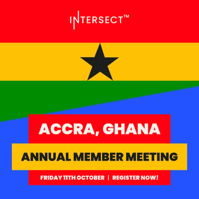
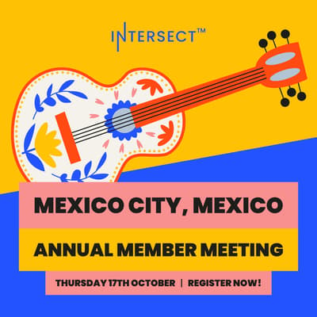

# 2024 Annual Member Meetings

## Overview

The member summits will allow community hubs to unite local members to discuss Cardano’s product roadmap and budget and how Intersect can continue supporting Cardano’s on-chain governance into 2025. The annual member summits will also be a chance to look back at the positives and negatives of Intersect’s first year and how we can build a stronger organization together.

In addition, we’ll highlight members who have submitted nominations for the [upcoming committee elections](https://intersect.gitbook.io/committee-elections-2024/) and governing board seats. Voting for these positions will be held in parallel with the annual meetings.

In addition to the in-person member summits, we’ll be hosting a special town hall covering the same content, including after-town halls and recognition for all the members and organizations who have contributed so much to Intersect and the Cardano ecosystem this year. More updates and information will follow over the coming days and weeks!

## Locations

[Intersect Luma Calendar](https://lu.ma/intersectmbo)

Tokyo, Japan

* Date: Thursday 3rd October 2024
* [Register here](https://lu.ma/giusvhux)

Lisbon, Portugal

* Saturday 5th October 2024
* [Register here](https://lu.ma/urc17dpb)

Virtual - Special Town Hall 

* Tuesday 8th October 2024
* [Register here](https://lu.ma/9ydajznf)

Accra, Ghana

* Friday 11th October 2024
* [Register here](https://lu.ma/aa273b76)

Colombo, Sri Lanka

* Saturday 12th October 2024
* [Register here](https://lu.ma/k94fjdrh)

Mexico City, Mexico

* Thursday 17th October 2024
* [Register here](https://lu.ma/sps4hiiy)

Austin, Texas

* Date: Saturday 19th October 2024
* [Register here](https://lu.ma/67wrmo10)

