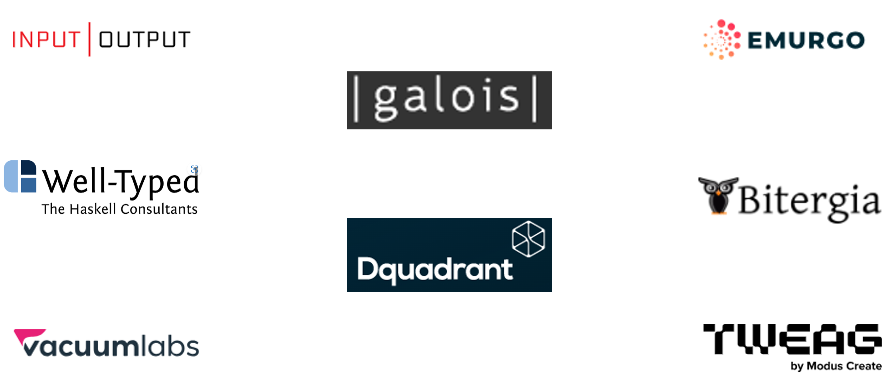

# Cardano continuity suppliers


This page has been **archived**&#x20;


## Who are our continuity suppliers?

Bitergia, Byron, DQuadrant, Emurgo, Galois, Input Output Global (IOI), Tweag, VacuumLabs, Well-Typed

<figure><figcaption></figcaption></figure>

## **Contract management**

* Our contract management process involves careful planning, monitoring, and evaluation to ensure all obligations are met and projects are completed on time and within budget, on behalf of the community.
* Intersect charges a flat 5% administrator fee to cover operational overhead for contract management. As a not-for-profit, all proceedings are reinvested and support various initiatives across our organization.

## **What work are our cardano continuity suppliers doing?**

*   **Current projects**

    * **Bloxico**\
      To facilitate Cardano’s age of Voltaire, Intersect develops multiple web app-based tools to enable users to engage with important Voltaire user journeys. This includes GovTool, Proposal Discussion Forum, DRep campaign platform, and the Constitutional Committee Portal. Bloxico develops a strategy to unite all these tools under one common set of recommendations and best practices.
    * **Byron**\
      Byron develops the GovTool WebApp, supports its launch, and runs a beta testing period to identify and fix bugs, gather feedback, and collect ideas.
    * **Emurgo**\
      Emurgo is focusing on the development and maintenance of the Serialization Library for efficient data handling, continuous improvement of the Yoroi Extension Wallet for secure asset management, updates to the Yoroi Mobile Wallet to enhance user experience, and the creation of educational materials to promote broader adoption and informed usage of Cardano's tools and features.
    * **Galois**\
      As part of the Halo 2 project, Galois leads the development of Zero-Knowledge Proofs (ZKPs) to enable future interoperability within the Cardano economy.
    * **Input Output Infrastructure**\
      Input Output Infrastructure group develops and tests the Cardano governance node in preparation for CIP-1694 and ongoing maintenance.
    * **Tweag**\
      Tweag works on the Ouroboros Genesis mechanism, which allows new nodes to join the Cardano blockchain and bootstrap themselves without relying on a trusted service and also enables disconnected nodes to rejoin the network.
    * **WellTyped**\
      WellTyped develops new Log Structured Merge Tree (LSM) implementations to store the ledger's UTxO set on disk instead of in memory. This innovation significantly increases the number of UTxOs, supports more users, and allows nodes to run on cheaper, lower-spec machines.
    * **VacLabs**\
      VacLabs ensures the continued practical use of Ledger and Trezor hardware wallets for the Cardano community and makes enhancements to support the Conway era.

*   **Future work**

    * We are excited about several upcoming projects that will further our mission and provide significant value to our stakeholders. In our commitment to maintaining transparency, we will keep you informed with regular updates. Stay tuned!

