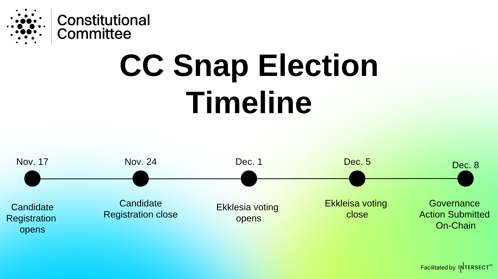

# Full CC snap election timeline

Key dates

All times are listed in UTC, beginning at 12:00 noon on each date.

* Monday, November 17:  Candidate registration opens&#x20;
* Monday, November 24:  Candidate registration closes; campaign week begins
* Monday, December 1:  Voting opens on Ekklesia
* Friday, December 5: Voting closes; results audited
* Monday, December 8: Governance Action submitted on-chain

<figure><figcaption></figcaption></figure>
