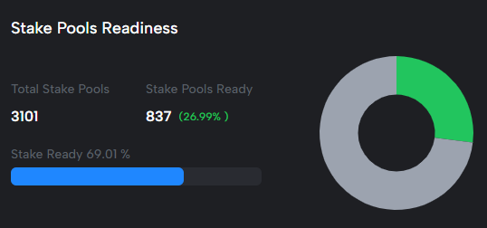

# Chang Upgrade #1 Readiness


This page is updated frequently and is open to community feedback to ensure the correctness of reporting.&#x20;

Email [hard-fork@intersectmbo.org](mailto:hard-fork@intersectmbo.org) if you spot any fixes.


## 👉 Call To Action Update

* By **Stake**, we have now reached <mark style="color:green;">**69%**</mark> of **SPOs** on 9.1.0 - the Hardfork Threshold for SPOs is close to being reached :tada:

<figure><figcaption>
By Stake 67% of SPOs on 9.1.0, with 837/3101 fully upgraded
</figcaption></figure>

* We are accelerating our outreach to **DApps** to progress the upgrade :mega::mega::mega:
* **Exchanges** are busy progressing with the upgrade with 24.56% ready  :handshake:
* The next potential Hardfork date is: 17th August, 2024 :tada::tada:, with the next possible date being 22nd August 2024

## Be aware of

* [**Cardano Node 9.1.0**](https://github.com/IntersectMBO/cardano-node/releases/tag/9.1.0) **is the mainnet candidate for Chang #1 hardfork.**&#x20;
* _Node 9.1.0 brings a configuration file update to Node 9.0.0._
* _GraphQL, Rosetta, Ogmios, and Cardano-wallet are now also compatible with 9.1.0_
* Ledger Nano S device support for Conway is stalled, all other devices are supported.
* DApps using Plutus V1 or V2 scripts must be aware of the new cost models being introduced which will change fees.
  * _Please see_ [_Script Cost Calculator_](https://docs.google.com/spreadsheets/d/1KFJCCbkDE5GaghlD4rDXB12pqLKnDFUNOKi0WErp\_-Q/edit?gid=0#gid=0) _from IOG Core Team._

***

## Status

Statuses legend

<mark style="color:green;">**Ready >**</mark> Ready for Chang #1 as signalled by the team

<mark style="color:orange;">**In Progress >**</mark> Team are preparing for Node 9.X.X integration and Hardfork Working Group is aware of remaining tasks

<mark style="color:blue;">**Not Started >**</mark> The work is not started but is criteria is understood

<mark style="color:red;">**Blocked >**</mark> Work is blocked

**TBC >** Unknown, status to be confirmed

***

### Core Infrastructure Components

Core infrastructure encompasses all technologies included within the Cardano Node, as well as key tools.


High-level status: <mark style="color:green;">**Ready**</mark>


<table><thead><tr><th width="228">Name</th><th width="312">Status </th><th width="173">Release</th></tr></thead><tbody><tr><td>Ledger</td><td><mark style="color:green;"><strong>Ready</strong></mark></td><td><a href="https://github.com/IntersectMBO/cardano-node/releases/tag/9.1.0">Node 9.1.0</a></td></tr><tr><td>Consensus</td><td><mark style="color:green;"><strong>Ready</strong></mark></td><td><a href="https://github.com/IntersectMBO/cardano-node/releases/tag/9.1.0">Node 9.1.0</a></td></tr><tr><td>Network</td><td><mark style="color:green;"><strong>Ready</strong></mark></td><td><a href="https://github.com/IntersectMBO/cardano-node/releases/tag/9.1.0">Node 9.1.0</a></td></tr><tr><td>Plutus Core</td><td><mark style="color:green;"><strong>Ready</strong></mark></td><td><a href="https://github.com/IntersectMBO/cardano-node/releases/tag/9.1.0">Node 9.1.0</a></td></tr><tr><td>Cardano CLI</td><td><mark style="color:green;"><strong>Ready</strong></mark></td><td><a href="https://github.com/IntersectMBO/cardano-cli/releases/tag/cardano-cli-9.2.1.0">9.2.1.0</a></td></tr><tr><td>DB-Sync</td><td><mark style="color:green;"><strong>Ready</strong></mark></td><td><a href="https://github.com/IntersectMBO/cardano-db-sync/releases/tag/13.3.0.0">DB-Sync 13.3.0.0</a></td></tr><tr><td>End to End Testing</td><td><mark style="color:green;"><strong>Ready</strong></mark></td><td><a href="https://tests.cardano.intersectmbo.org/test_results/node/tag_9_0_0.html">Test Report</a></td></tr><tr><td>Performance and Tracing </td><td><mark style="color:green;"><strong>Ready</strong></mark></td><td><a href="https://tests.cardano.intersectmbo.org/test_results/node/tag_9_0_0.html">Test Report</a></td></tr></tbody></table>

***

### Environments

Cardano has a range of network environments, and each will require a Hard Fork, below we compare the prevalence of Cardano blocks created by Node versions within the last 8 hours. 75%+ will indicate readiness for the Hard Fork to Conway ( Protocol 9.0)


High-level status: <mark style="color:orange;">**In Progress**</mark>


<table><thead><tr><th width="138">Network</th><th width="154">9.0.0 Blocks (%)</th><th width="170">9.1.0 Blocks (%)</th><th width="155">Ledger Era</th><th>Governance</th></tr></thead><tbody><tr><td>MainNet</td><td><mark style="color:orange;"><strong>2%</strong></mark></td><td><mark style="color:orange;"><strong>69%</strong></mark></td><td>Babbage</td><td>N/A</td></tr><tr><td>PreProd</td><td><mark style="color:orange;"><strong>0.38%</strong></mark></td><td><mark style="color:orange;"><strong>63%</strong></mark></td><td>Babbage</td><td>N/A</td></tr><tr><td>Preview</td><td><mark style="color:orange;"><strong>9%</strong></mark></td><td><mark style="color:orange;"><strong>76%</strong></mark></td><td>Conway</td><td>Bootstrapping Phase</td></tr><tr><td>SanchoNet</td><td><mark style="color:green;"><strong>100%</strong></mark></td><td><em>0% (will remain on 9.0.0)</em></td><td>Conway</td><td>Full (post-bootstrapping)</td></tr></tbody></table>

For _live_ numbers please visit [Cexplorer/versions](https://cexplorer.io/versions) preprod.Cexplorer preview.cexplorer

| Total Stake Pools | Stake Pools Ready | Stake Ready % |
| ----------------- | ----------------- | ------------- |
| 3109              | 378               | 31.71 %       |

For the latest numbers please visit: [cardanoscan](https://cardanoscan.io/changreadiness)


Section maintained by IOG Core Tech Team

Last Updated; 2024-08-02


***

### Exchange Readiness

Exchange readiness is tracked against the top exchanges by ADA liquidity (as reported by [Cexplorer/hfs](https://cexplorer.io/hfs)).


High-level status: <mark style="color:orange;">**In Progress**</mark>


<table><thead><tr><th width="199">Exchange</th><th width="302">Status</th><th width="213">Liquidity %</th></tr></thead><tbody><tr><td>Binance</td><td><mark style="color:orange;"><strong>In Progress</strong></mark></td><td>15.09%</td></tr><tr><td>Bitget</td><td><mark style="color:orange;"><strong>In Progress</strong></mark></td><td>6.49%</td></tr><tr><td>Coinbase Exchange</td><td><mark style="color:orange;"><strong>In Progress</strong></mark></td><td>3.09%</td></tr><tr><td>Upbit</td><td><mark style="color:orange;"><strong>In Progress</strong></mark></td><td>2.79%</td></tr><tr><td>OKX</td><td><mark style="color:orange;"><strong>In Progress</strong></mark></td><td>1.89%</td></tr><tr><td>Crypto.com</td><td><mark style="color:orange;"><strong>In Progress</strong></mark></td><td>1.52%</td></tr><tr><td>Kraken.com</td><td><mark style="color:orange;"><strong>In Progress</strong></mark></td><td>1.08%</td></tr><tr><td>Gate.io</td><td><mark style="color:orange;"><strong>In Progress</strong></mark></td><td>0.93%</td></tr><tr><td>Upbit</td><td><mark style="color:orange;"><strong>In Progress</strong></mark></td><td>0.97%</td></tr><tr><td>Bitfinex</td><td><mark style="color:orange;"><strong>In Progress</strong></mark></td><td>0.88%</td></tr><tr><td>MEXC</td><td><mark style="color:orange;"><strong>In Progress</strong></mark></td><td>0.19%</td></tr><tr><td>CEX.IO</td><td><mark style="color:orange;"><strong>In Progress</strong></mark></td><td>0.04%</td></tr><tr><td>Paribu</td><td><mark style="color:orange;"><strong>In Progress</strong></mark></td><td>0.04%</td></tr><tr><td>FMW.io</td><td><mark style="color:green;"><strong>Ready</strong></mark></td><td>7.70%</td></tr><tr><td>HitBTC</td><td><mark style="color:green;"><strong>Ready</strong></mark></td><td>0.04%</td></tr><tr><td>WhiteBIT</td><td><mark style="color:green;"><strong>Ready</strong></mark></td><td>14.18%</td></tr><tr><td>BitMart</td><td><mark style="color:green;"><strong>Ready</strong></mark></td><td>0.36%</td></tr><tr><td>Bitfinex</td><td><mark style="color:green;"><strong>Ready</strong></mark></td><td>0.76%</td></tr><tr><td>Gate.io</td><td><mark style="color:green;"><strong>Ready</strong></mark></td><td>1.46%</td></tr><tr><td>HTX</td><td><mark style="color:blue;"><strong>Not Started</strong></mark></td><td>11.50%</td></tr><tr><td>Changelly Pro</td><td><mark style="color:blue;"><strong>Not Started</strong></mark></td><td>7.78%</td></tr><tr><td>WhiteBIT</td><td><mark style="color:blue;"><strong>Not Started</strong></mark></td><td>9.75%</td></tr><tr><td>FMFW.io</td><td><mark style="color:blue;"><strong>Not Started</strong></mark></td><td>7.76%</td></tr><tr><td>HitBTC</td><td><mark style="color:blue;"><strong>Not Started</strong></mark></td><td>7.73%</td></tr></tbody></table>

For the latest info on _Exchanges by Liquidity_ please visit: [Cardanoscan](https://cardanoscan.io/changreadiness) and [Cexplorer](https://cexplorer.io/hfs).


Section maintained by Cardano Foundation

Last Updated; 2024-08-02


***

### Tooling Readiness

Tooling readiness is tracked against Node 9.X.X compatible releases and reported by each team.

#### Low-Level Tooling

We define Low-Level Tooling, as tools which are required by higher-level tools, dApps, and wallets.


High-level status: <mark style="color:orange;">**In Progress**</mark>

More details; Low-Level Tooling Chang Readiness Details


Libraries

<table><thead><tr><th width="189">Library</th><th>Status</th><th>Release Version</th></tr></thead><tbody><tr><td>Cardano Serialization Library</td><td><mark style="color:orange;"><strong>In Progress</strong></mark></td><td><em>Pending (see</em> <a href="https://github.com/Emurgo/cardano-serialization-lib/releases"><em>releases page</em></a><em>)</em></td></tr><tr><td>Cardano Multiplatform Library</td><td><mark style="color:green;"><strong>Ready</strong></mark></td><td><a href="https://github.com/dcSpark/cardano-multiplatform-lib/releases/tag/5.3.0">5.3.0</a></td></tr><tr><td>Cardano JavaScript SDK</td><td><mark style="color:green;"><strong>Ready</strong></mark></td><td>See <a href="https://github.com/input-output-hk/cardano-js-sdk/releases">releases page</a></td></tr><tr><td>Pallas</td><td><mark style="color:orange;"><strong>In Progress</strong></mark></td><td><em>Pending (see</em> <a href="https://github.com/txpipe/pallas/releases"><em>releases page</em></a><em>)</em></td></tr><tr><td>Cardano Transaction Library</td><td><mark style="color:orange;"><strong>In Progress</strong></mark></td><td><em>Pending (see</em> <a href="https://github.com/Plutonomicon/cardano-transaction-lib/blob/develop/CHANGELOG.md#changelog"><em>changelong</em></a><em>)</em></td></tr></tbody></table>

Tools

<table><thead><tr><th width="193">Tools</th><th width="187">Status </th><th width="251">Release Version</th></tr></thead><tbody><tr><td>cardano-wallet</td><td><mark style="color:green;"><strong>Ready</strong></mark></td><td><em>Pending (see</em> <a href="https://github.com/cardano-foundation/cardano-wallet/releases"><em>releases page</em></a><em>)</em></td></tr><tr><td>Rosetta</td><td><mark style="color:green;"><strong>Ready</strong></mark></td><td>Rosetta 2.3.0 <em>include node 9.1.0</em> <em>(see</em> <a href="https://github.com/cardano-foundation/cardano-rosetta/releases"><em>releases page</em></a><em>)</em></td></tr><tr><td>GraphQL</td><td><mark style="color:green;"><strong>Ready</strong></mark></td><td><em>Pending (see</em> <a href="https://github.com/cardano-foundation/cardano-graphql/releases"><em>releases page</em></a><em>)</em></td></tr><tr><td>cntools (guild-operators)</td><td><mark style="color:orange;"><strong>In Progress</strong></mark></td><td><em>Pending (see</em> <a href="https://github.com/cardano-community/guild-operators/tree/node-9.0.0"><em>branch</em></a><em>)</em></td></tr><tr><td>SPO Scripts (@gitmachtl)</td><td><mark style="color:green;"><strong>Ready</strong></mark></td><td><a href="https://github.com/gitmachtl/scripts/releases/tag/9.0.0-mainnet">SPO Scripts for Node 9.0.0 (Mainnet)</a></td></tr></tbody></table>

Indexers

| Indexers | Status                                             | Version                                                                                   |
| -------- | -------------------------------------------------- | ----------------------------------------------------------------------------------------- |
| Ogmios   | <mark style="color:green;">**Ready**</mark>        | [v6.5.0](https://github.com/CardanoSolutions/ogmios/releases/tag/v6.5.0)                  |
| Oura     | <mark style="color:orange;">**In Progress**</mark> | _Pending (see_ [_releases page_](https://github.com/txpipe/scrolls/releases)_)_           |
| Scrolls  | <mark style="color:orange;">**In Progress**</mark> | _Pending (see_ [_releases page_](https://github.com/txpipe/scrolls/releases)_)_           |
| DB-Sync  | <mark style="color:green;">**Ready**</mark>        | [DB-Sync 13.3.0.0](https://github.com/IntersectMBO/cardano-db-sync/releases/tag/13.3.0.0) |
| Carp     | <mark style="color:green;">**Ready**</mark>        | [3.2.0](https://github.com/dcSpark/carp/releases/tag/3.2.0)                               |

#### Higher Level Tooling

<table><thead><tr><th width="167">Tools</th><th>Status</th></tr></thead><tbody><tr><td>Blockfrost</td><td><mark style="color:orange;"><strong>In Progress</strong></mark></td></tr><tr><td>Maestro</td><td><mark style="color:orange;"><strong>In Progress</strong></mark></td></tr><tr><td>Koios</td><td><mark style="color:orange;"><strong>In Progress</strong></mark></td></tr></tbody></table>


Section maintained by Cardano Foundation

Last updated; 2024-08-01


***

### Wallets Readiness

Wallet readiness is tracked against their integration against Cardano Node versions, as well as self-reported readiness.


High-level status: <mark style="color:orange;">**In Progress**</mark>


#### Light Wallets

<table><thead><tr><th width="175">Wallet</th><th width="286">Highlevel Status</th><th>Preview Network</th></tr></thead><tbody><tr><td>Lace</td><td><mark style="color:green;"><strong>Ready</strong></mark></td><td><mark style="color:green;"><strong>Ready</strong></mark></td></tr><tr><td>Yoroi</td><td><mark style="color:green;"><strong>Ready</strong></mark></td><td><mark style="color:green;"><strong>Ready</strong></mark></td></tr><tr><td>Yoroi (Mobile)</td><td><mark style="color:green;"><strong>Ready</strong></mark></td><td><mark style="color:green;"><strong>Ready</strong></mark><strong> (no governance features)</strong></td></tr><tr><td>Nufi</td><td><mark style="color:green;"><strong>Ready</strong></mark></td><td><mark style="color:orange;"><strong>In Progress</strong></mark></td></tr><tr><td>Eternl</td><td><mark style="color:green;"><strong>Ready</strong></mark></td><td><mark style="color:green;"><strong>Ready</strong></mark></td></tr><tr><td>Eternl (mobile)</td><td><mark style="color:green;"><strong>Ready</strong></mark></td><td><mark style="color:green;"><strong>Ready</strong></mark></td></tr><tr><td>Gero</td><td><mark style="color:green;"><strong>Ready</strong></mark></td><td><mark style="color:orange;"><strong>In Progress</strong></mark></td></tr><tr><td>Gero Mobile</td><td><mark style="color:orange;"><strong>In Progress</strong></mark></td><td><mark style="color:orange;"><strong>In Progress</strong></mark></td></tr><tr><td>Vespr</td><td><mark style="color:orange;"><strong>In Progress</strong></mark></td><td><mark style="color:orange;"><strong>In Progress</strong></mark></td></tr><tr><td>Vespr (Mobile)</td><td><mark style="color:orange;"><strong>In Progress</strong></mark></td><td><mark style="color:orange;"><strong>In Progress</strong></mark></td></tr><tr><td>Nami</td><td><mark style="color:green;"><strong>Ready</strong></mark><strong> (no governance features)</strong></td><td><mark style="color:green;"><strong>Ready</strong></mark><strong> (no governance features)</strong></td></tr><tr><td>Flint</td><td><mark style="color:orange;"><strong>In Progress</strong></mark></td><td><mark style="color:orange;"><strong>In Progress</strong></mark></td></tr><tr><td>Flint (Mobile)</td><td><mark style="color:orange;"><strong>In Progress</strong></mark></td><td><mark style="color:orange;"><strong>In Progress</strong></mark></td></tr><tr><td>Begin</td><td><mark style="color:green;"><strong>Ready</strong></mark></td><td><mark style="color:green;"><strong>Ready</strong></mark></td></tr><tr><td>Typhon</td><td><mark style="color:orange;"><strong>In Progress</strong></mark></td><td><mark style="color:orange;"><strong>In Progress</strong></mark></td></tr></tbody></table>

#### Hardware Wallets

<table><thead><tr><th width="177">Wallet</th><th>Readiness</th></tr></thead><tbody><tr><td>Trezor</td><td><mark style="color:green;"><strong>Ready</strong></mark></td></tr><tr><td>Ledger (Nano S+, Nano X, Stax)</td><td><mark style="color:green;"><strong>Ready</strong></mark></td></tr><tr><td>Ledger (Nano S)</td><td><mark style="color:orange;"><strong>In Progress</strong></mark><strong> (Unlikely to be ready for Chang #1)</strong></td></tr><tr><td>Keystone</td><td><mark style="color:green;"><strong>Ready</strong></mark></td></tr></tbody></table>

#### Full Node / CLI Wallets

<table><thead><tr><th width="182">Wallet</th><th>Readiness</th></tr></thead><tbody><tr><td>Daedalus</td><td><mark style="color:orange;"><strong>In Progress</strong></mark></td></tr><tr><td>AdaLite</td><td><mark style="color:orange;"><strong>In Progress</strong></mark></td></tr><tr><td>CNTools</td><td><mark style="color:green;"><strong>Ready</strong></mark></td></tr></tbody></table>


Section maintained by the Wallets Working Group

Last updated; 2024-08-13


***

### DApp Project Readiness

DApp readiness is tracked against self reported readiness, dApp developers do need to prepare as Conway will change costing around the use of reference scripts.

_Please see_ [_Ref Script Cost Calculator_](https://docs.google.com/spreadsheets/d/1KFJCCbkDE5GaghlD4rDXB12pqLKnDFUNOKi0WErp\_-Q/edit?gid=0#gid=0) _from IOG Core Team._


High-level status: **TBC**


<table><thead><tr><th width="210">Project</th><th width="263">Status</th></tr></thead><tbody><tr><td>Charli3</td><td><mark style="color:green;"><strong>Ready</strong></mark></td></tr><tr><td>Axo</td><td><mark style="color:orange;"><strong>In Progress</strong></mark></td></tr><tr><td>Minswap</td><td><strong>TBC</strong></td></tr><tr><td>SundaeSwap</td><td><strong>TBC</strong></td></tr><tr><td>Wingriders</td><td><strong>TBC</strong></td></tr><tr><td>DexHunter</td><td><strong>TBC</strong></td></tr><tr><td>Axo</td><td><strong>TBC</strong></td></tr><tr><td>Optim</td><td><strong>TBC</strong></td></tr><tr><td>Spectrum</td><td><strong>TBC</strong></td></tr><tr><td>Splash</td><td><strong>TBC</strong></td></tr><tr><td>Genius Yield</td><td><strong>TBC</strong></td></tr><tr><td>Indigo</td><td><strong>TBC</strong></td></tr><tr><td>Liqwid (finance)</td><td><strong>TBC</strong></td></tr><tr><td>Djed</td><td><strong>TBC</strong></td></tr><tr><td>USDM</td><td><strong>TBC</strong></td></tr><tr><td>Levvy</td><td><strong>TBC</strong></td></tr><tr><td>Orcfax</td><td><strong>TBC</strong></td></tr><tr><td>Iagon</td><td><strong>TBC</strong></td></tr><tr><td>NMKR</td><td><strong>TBC</strong></td></tr><tr><td>Book.io</td><td><strong>TBC</strong></td></tr><tr><td>NEWM</td><td><strong>TBC</strong></td></tr><tr><td>Rosenbridge</td><td><strong>TBC</strong></td></tr><tr><td>MyUSD</td><td><strong>TBC</strong></td></tr><tr><td>Encoins</td><td><strong>TBC</strong></td></tr><tr><td>Clarity</td><td><strong>TBC</strong></td></tr><tr><td>Summon</td><td><strong>TBC</strong></td></tr><tr><td>JPG.Store</td><td><strong>TBC</strong></td></tr><tr><td>MuesliSwap</td><td><strong>TBC</strong></td></tr><tr><td>Lending Pond</td><td><strong>TBC</strong></td></tr><tr><td>Fluid Tokens</td><td><strong>TBC</strong></td></tr><tr><td>LenfiAada</td><td><strong>TBC</strong></td></tr><tr><td>VyFinance</td><td><strong>TBC</strong></td></tr><tr><td>ADAX Pro</td><td><strong>TBC</strong></td></tr><tr><td>Lenfi</td><td><strong>TBC</strong></td></tr><tr><td>Revuto</td><td><strong>TBC</strong></td></tr><tr><td>Artano</td><td><strong>TBC</strong></td></tr></tbody></table>


Section maintained by Anatasia Labs

Last updated; 2024-07-25


### Supporting Governance Initiatives - Readiness

The Chang #1 hardfork will introduce governance to Cardano, specific tooling is being developed to support the governance model.

#### Governance Tooling


High-level status: <mark style="color:orange;">**In Progress**</mark>


<table><thead><tr><th width="170">Tool</th><th width="216">Status</th></tr></thead><tbody><tr><td>GovTool</td><td><mark style="color:orange;"><strong>In Progress</strong></mark></td></tr><tr><td>Constitutional Committee Portal</td><td><mark style="color:orange;"><strong>In Progress</strong></mark></td></tr><tr><td>DRep Campaign Platform</td><td><mark style="color:orange;"><strong>In Progress</strong></mark></td></tr></tbody></table>


Section maintained by the Governance Tools Working Group

Last Updated; 2024-07-25


#### Interim Constitutional Committee Readiness

Interim Constitutional Committee readiness is tracked against training module completion as well as on-chain mainnet cold credential creation.


High-level status: <mark style="color:green;">**Ready**</mark>


<table><thead><tr><th width="290" align="center">Member</th><th>Readiness</th></tr></thead><tbody><tr><td align="center">Cardano Atlantic Council</td><td><mark style="color:green;"><strong>Ready</strong></mark></td></tr><tr><td align="center">Cardano Japan</td><td><mark style="color:green;"><strong>Ready</strong></mark></td></tr><tr><td align="center">Cardano Foundation</td><td><mark style="color:green;"><strong>Ready</strong></mark></td></tr><tr><td align="center">Eastern Cardano Council</td><td><mark style="color:green;"><strong>Ready</strong></mark></td></tr><tr><td align="center">Emurgo</td><td><mark style="color:green;"><strong>Ready</strong></mark></td></tr><tr><td align="center">Intersect</td><td><mark style="color:green;"><strong>Ready</strong></mark></td></tr><tr><td align="center">Input Output</td><td><mark style="color:green;"><strong>Ready</strong></mark></td></tr></tbody></table>


Section maintained by IOG Voltaire Team

Last Updated; 2024-07-25


#### DRep Pioneer Program                                                                                                                                                                                                                                                                                                                                                                                                                                                                                                                                                                                                                                                                                                                                                                                                                                                                                                                                                                                                                                                                                                                                                                                                                                                                                                                                                                                                                                                                                                                                                                                                         &#x20;

DRep Pioneer Program readiness is tracked against total number of participants who have gone through a DRep pioneer program workshop.\
Learn more and get involved: [DRep Pioneer Program Overview](https://app.gitbook.com/o/Prbm1mtkwSsGWSvG1Bfd/s/VNa3QAZtN9ihYGiFy8AM/).


High-level status: <mark style="color:orange;">**In Progress**</mark>


<table><thead><tr><th width="284">Total DRep Training Completed</th><th>Status</th></tr></thead><tbody><tr><td>50</td><td><mark style="color:green;"><strong>Ready</strong></mark></td></tr><tr><td>75</td><td><mark style="color:green;"><strong>Ready</strong></mark></td></tr><tr><td>100</td><td><mark style="color:green;"><strong>Ready</strong></mark></td></tr><tr><td>150</td><td><mark style="color:green;"><strong>Ready</strong></mark></td></tr><tr><td>300</td><td><mark style="color:orange;"><strong>In Progress</strong></mark></td></tr></tbody></table>


Section maintained by Intersect DRep Pioneer Program lead

Last Updated; 2024-07-25


***

### Community Readiness

Qualitative feedback and sentiment from key committees, hubs, and working groups on their readiness for the hard fork.


High-level status: <mark style="color:orange;">**In Progress**</mark>


<table><thead><tr><th width="246">Area</th><th width="282">Status</th></tr></thead><tbody><tr><td>Hard Fork Working Group</td><td><mark style="color:orange;"><strong>In Progress</strong></mark></td></tr><tr><td>Parameters Committee</td><td><mark style="color:orange;"><strong>In Progress</strong></mark></td></tr><tr><td>Open Source Committee</td><td><mark style="color:orange;"><strong>In Progress</strong></mark></td></tr><tr><td>Membership and Community Committee</td><td><mark style="color:orange;"><strong>In Progress</strong></mark></td></tr><tr><td>Civics Committee</td><td><mark style="color:orange;"><strong>In Progress</strong></mark></td></tr><tr><td>Intersect Hubs</td><td><mark style="color:orange;"><strong>In Progress</strong></mark></td></tr></tbody></table>


Section maintained by Intersect

Last Updated; 2024-07-29


***

More information on the [Major Release Process](https://docs.intersectmbo.org/cardano/cardano-upgrades/major-release-process) is also available, as well as a [frequently asked questions](https://docs.intersectmbo.org/cardano/cardano-upgrades/hard-forks/hard-fork-frequently-asked-questions) page.
