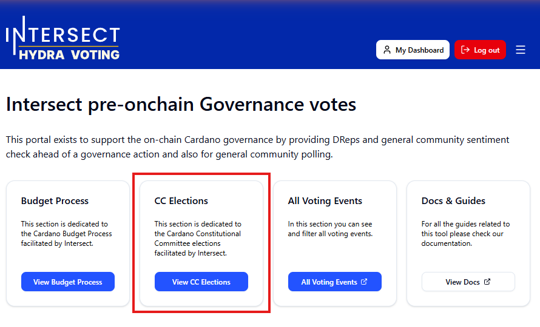
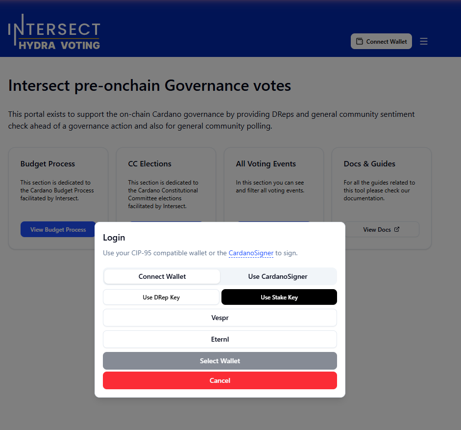
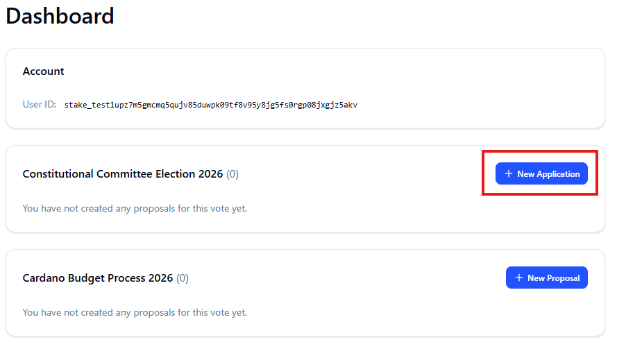

# 🗳️How to Apply for CC elections



### Step 1 — Navigate to the Platform

Go to [https://hydra-voting.intersectmbo.org/](https://hydra-voting.intersectmbo.org/) and click **View CC Elections**.

This will take you to the Cardano Constitutional Committee Elections 2026 page.

<figure><figcaption></figcaption></figure>




### Step 2 — Connect Your Wallet

Click **Connect Wallet** in the top right corner.

Select your preferred option:

* **Connect Wallet** (CIP-95 compatible wallet)
* **CardanoSigner**
* **Stake Key**

Select your wallet (e.g. Eternl), then sign it with your stake key.

Once connected, your wallet will be linked to your session.

<figure><figcaption></figcaption></figure>




### Step 3 — Start Your Application

Click **My Dashboard** and then click **+ New Application** to begin your CC election application.

<figure><figcaption></figcaption></figure>




### Step 4 — Select Your Track

On the **Track Selection** screen, choose the candidate type that applies to you:

Individual

Select **Individual** if you are applying as a single person representing yourself.

The form is divided into 5 sections:

**1. Identity & Contact**

* **Full name or alias** _(required)_ — the name that will appear publicly on your candidacy
* **Contact email** _(required, private)_ — not publicly visible
* **Geographic region** _(optional)_ — select the region you represent
* **Pool ID** _(optional)_ — if you operate a stake pool
* **DRep ID** _(optional)_ — if you are a registered DRep
* **Social & professional links** _(optional)_ — X (Twitter), LinkedIn, Website, and additional links

**2. Background & Expertise**

* **Professional Background** _(required)_ — your professional history relevant to the role
* **Governance Experience** _(required)_ — e.g. Catalyst participation, DAO contributions, committee roles

**3. Biography & Governance Statement**

* **Brief Biography** _(required)_ — a short summary of your background and ecosystem involvement
* **Conflict of Interest Statement** _(optional)_ — list any affiliations, roles, or financial interests
* **Contributions to Cardano** _(required)_ — projects, tools, or initiatives you have contributed to
* **Motivation** _(required)_ — why you are running and what you aim to contribute
* **Why is Decentralised Governance Important to you?** _(required)_ — your views on decentralisation
* **Constitutional Familiarity & Interpretation** _(required)_ — how you read, interpret, and apply the Cardano Constitution
* **Perspective You Would Bring** _(required)_ — unique skills or viewpoints you bring to the committee
* **Transparency Approach** _(required)_ — how you will communicate decisions and reasoning to the community

**4. Cold Credentials**

> CC members must generate cold keys before taking office. Follow the [Constitutional Committee Cold Credential Guide](https://developers.cardano.org/docs/get-started/infrastructure/cardano-cli/governance/constitutional%20committee/) before submitting.

* **Cold Credential Hash** _(required)_ — your `cc_cold1...` hash
*   **Credential Type** _(required)_ — choose one:

    * **Key Credential** — a standard cold key generated for individual use
    * **Script Credential** — a native or Plutus script acting as the authorisation credential

    <figure><figcaption></figcaption></figure>

**5. Declaration & Agreement**

* Check **"I confirm all information is accurate and consent to it being publicly visible on the Ekklesia candidate directory."**
* Check **"I agree to the Intersect CC Election Terms & Conditions and Code of Conduct."**

Once all sections are complete, click **Preview Proposal** to review, then **Submit Proposal** to finalise your application. You can also click **Save & Exit** at any time — by logging in with the same wallet you can continue your application later. The form is also auto-saved every 2 minutes.

Organisation

Select **Organisation** if you are applying on behalf of a single organisation.

The form is divided into 5 sections:

**1. Organisation Details**

* **Organisation name** _(required)_ — the name that will appear publicly on your candidacy
* **Organisational description** _(required)_ — a brief overview of your mission, structure, and activities in the ecosystem
* **Geographic region** _(optional)_ — select the region your organisation represents
* **Contact person** _(required, private)_ — the primary contact, not publicly visible
* **Contact email** _(required, private)_ — not publicly visible
* **Pool ID** _(optional)_ — if your organisation operates a stake pool
* **DRep ID** _(optional)_ — if your organisation is a registered DRep
* **Social & professional links** _(optional)_ — X (Twitter), LinkedIn, Website, and additional links

**2. Background & Expertise**

* **Organisational Areas of Expertise** _(required)_ — e.g. governance, legal advisory, blockchain development, research
* **Governance Experience** _(required)_ — e.g. DAO participation, Catalyst proposals, advisory or committee roles

**3. Governance Statement**

* **Conflict of Interest Statement** _(optional)_ — list any affiliations or financial interests
* **Contributions to Cardano** _(required)_ — projects or ecosystem initiatives your organisation has delivered
* **Motivation** _(required)_ — why your organisation is applying and what it aims to contribute
* **Why is Decentralised Governance Important to your organisation?** _(required)_ — your organisation's perspective on decentralisation and governance
* **Constitutional Familiarity & Interpretation** _(required)_ — how your organisation will interpret and apply the Cardano Constitution
* **Perspective You Would Bring** _(required)_ — unique strengths, expertise, or viewpoints your organisation brings
* **Transparency Approach** _(required)_ — how your organisation will communicate decisions, votes, and reasoning to the community

**4. Cold Credentials**

> CC members must generate cold keys before taking office. Follow the [Constitutional Committee Cold Credential Guide](https://developers.cardano.org/docs/learn/cardano-cli/governance/constitutional-committee/) before submitting.

* **Cold Credential Hash** _(required)_ — your `cc_cold1...` hash
*   **Credential Type** _(required)_ — choose one:

    * **Key Credential** — a standard cold key generated for individual use
    * **Script Credential** — a native or Plutus script acting as the authorisation credential

    <figure><figcaption></figcaption></figure>

**5. Declaration & Agreement**

* Check **"I confirm all information is accurate and consent to it being publicly visible on the Ekklesia candidate directory."**
* Check **"I agree to the Intersect CC Election Terms & Conditions and Code of Conduct."**

Once all sections are complete, click **Preview Proposal** to review, then **Submit Proposal** to finalise your application. You can also click **Save & Exit** at any time — by logging in with the same wallet you can continue your application later. The form is also auto-saved every 2 minutes.

Consortium

Select **Consortium** if you are applying as a group of organisations forming a consortium. A minimum of **2 members** is required, and you can add as many members as needed.

The form is divided into 5 sections:

**1. Consortium Details**

* **Consortium name** _(required)_ — the name that will appear publicly on your candidacy
* **Contact person** _(required, private)_ — the primary contact, not publicly visible
* **Contact email** _(required, private)_ — not publicly visible
* **Social & public links** _(optional)_ — X (Twitter), LinkedIn, Website, and additional links

**2. Consortium Governance Statement**

* **Conflict of Interest Statement** _(optional, private)_ — list any consortium-level affiliations or financial interests
* **Contributions to Cardano** _(required)_ — what contributions have consortium members made (e.g. Member A: Catalyst proposals; Member B: core development)
* **Motivation** _(required)_ — why your consortium is applying and what it aims to contribute
* **Why is Decentralised Governance Important to your consortium?** _(required)_ — your consortium's perspective on decentralisation and governance
* **Constitutional Familiarity & Interpretation** _(required)_ — how your consortium will interpret and apply the Cardano Constitution
* **Perspective You Would Bring** _(required)_ — unique strengths, expertise, or viewpoints your consortium brings
* **Transparency Approach** _(required)_ — how your consortium will communicate decisions, votes, and reasoning to the community
* **Internal Decision Making** _(required)_ — how your consortium makes internal decisions

**3. Cold Credentials**

> CC members must generate cold keys before taking office. Follow the [Constitutional Committee Cold Credential Guide](https://developers.cardano.org/docs/learn/cardano-cli/governance/constitutional-committee/) before submitting.

* **Cold Credential Hash** _(required)_ — your consortium's combined `cc_cold1...` hash
*   **Credential Type** _(required)_ — choose one:

    * **Key Credential** — a standard cold key generated for individual use
    * **Script Credential** — a native or Plutus script acting as the authorisation credential

    <figure><figcaption></figcaption></figure>

**4. Consortium Members**

Add each member of the consortium. Click **+ Add Member** to add more members. All member profiles are publicly visible. A minimum of **2 members** is required, but there is no upper limit.

**5. Declaration & Agreement**

* Check **"I confirm all information is accurate and consent to it being publicly visible on the Ekklesia candidate directory."**
* Check the **Member Identity Vouching** declaration, confirming all listed members have consented to being part of the application.
* Check **"I agree to the Intersect CC Election Terms & Conditions and Code of Conduct."**

Once all sections are complete, click **Preview Proposal** to review, then **Submit Proposal** to finalise your application. You can also click **Save & Exit** at any time — by logging in with the same wallet you can continue your application later. The form is also auto-saved every 2 minutes.



