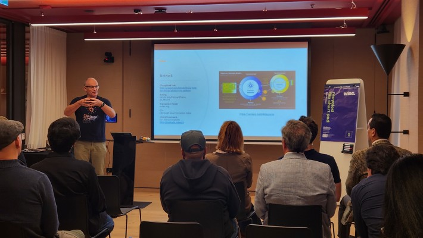
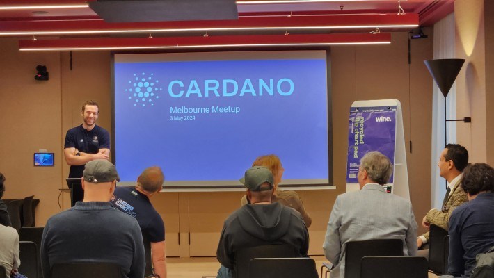

# Cardano Blockchain Melbourne, Australia - 3rd May 2024

An event in Melbourne led by Peter Horsfall to put a face to the name and engage in conversation about Cardano/ADA. More details here: [https://www.meetup.com/cardano-blockchain-melbourne/](https://www.meetup.com/cardano-blockchain-melbourne/)

Event date: 3rd May 2024

Blog post event - Cardano Melbourne: Build | Network | Governance | Services

* LinkedIN: [https://www.linkedin.com/pulse/cardano-melbourne-build-network-governance-services-peter-horsfall-vuppe?trackingId=cVUD6i3YQ8C2zSiql%2BXrYQ%3D%3D\&lipi=urn%3Ali%3Apage%3Ad\_flagship3\_detail\_base%3B4ojPm8sOQeaN9LiPt3QAOw%3D%3D](https://www.linkedin.com/pulse/cardano-melbourne-build-network-governance-services-peter-horsfall-vuppe?trackingId=cVUD6i3YQ8C2zSiql%2BXrYQ%3D%3D\&lipi=urn%3Ali%3Apage%3Ad_flagship3_detail_base%3B4ojPm8sOQeaN9LiPt3QAOw%3D%3D) / [https://www.linkedin.com/in/peterhorsfall/](https://www.linkedin.com/in/peterhorsfall/)
* X/Twitter: [https://twitter.com/blockchain\_pete/status/1787290052378366411](https://twitter.com/blockchain_pete/status/1787290052378366411)

<figure><figcaption></figcaption></figure> <figure><figcaption></figcaption></figure>

<figure><figcaption></figcaption></figure>
