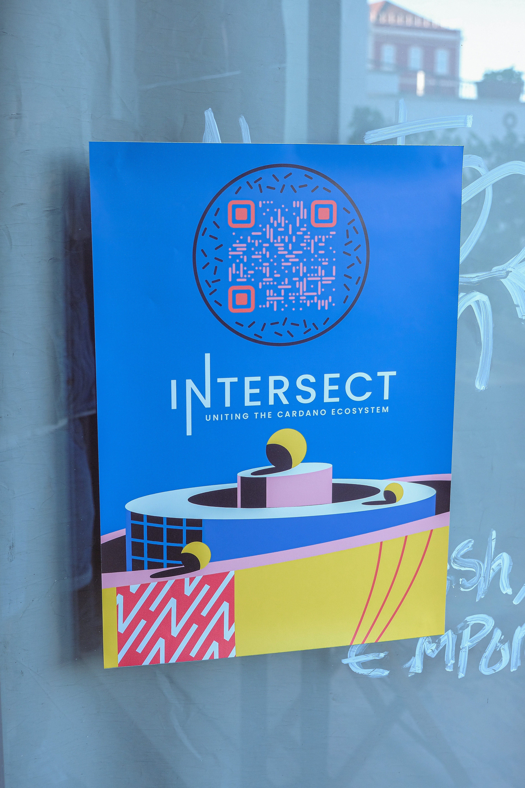
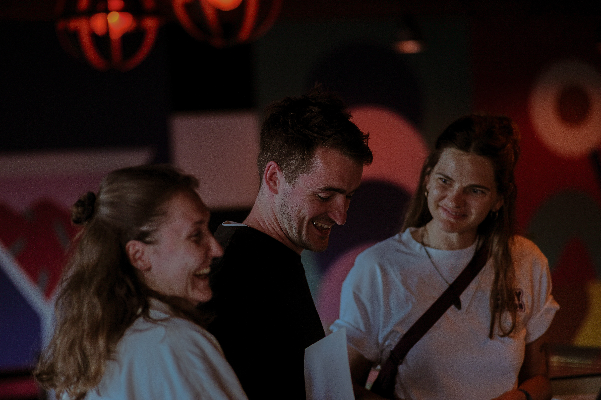
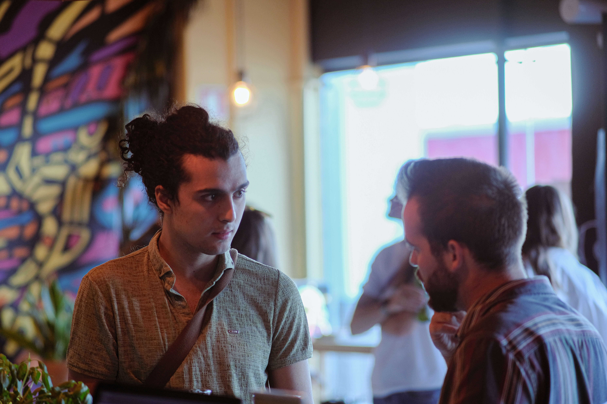
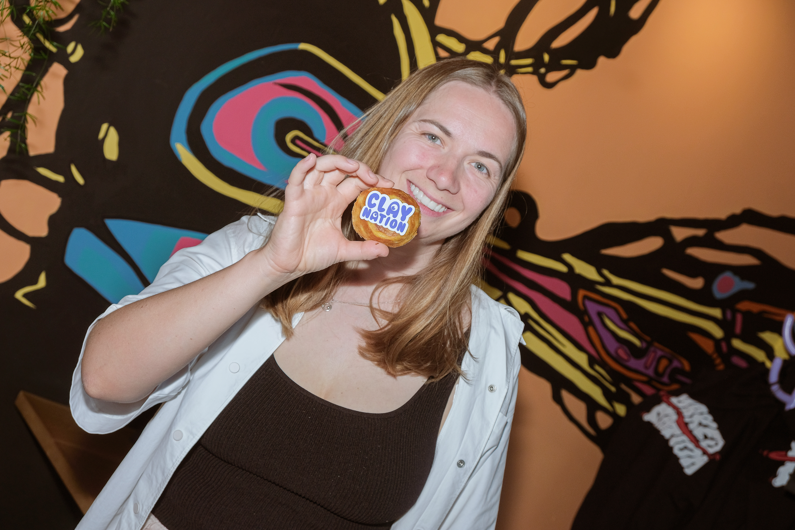

# Clay Labs Digital - Lisbon, Portugal - 27th May 2024

Clay Labs Digital will host an Intersect meetup during [NFC Lisbon](https://cointelegraph.com/press-releases/nfc-2024-in-lisbon-28-30-may-one-ticket-five-events) which takes place 27-30 of May. They will aim to register the event as an official NFC side event, to try and boost participation from individuals less accustomed with Cardano.

Sign up here: [https://lu.ma/lgyg6z67](https://lu.ma/lgyg6z67)

## [Community meet-up in Lisbon blog](https://docs.google.com/document/d/1crZnJ7jnCEHrf55doaiL8ZHnX-iZUFghx1lKOPGUsV0/edit)&#x20;

<figure><figcaption></figcaption></figure> <figure><figcaption></figcaption></figure>

<figure><figcaption></figcaption></figure> <figure><figcaption></figcaption></figure> <figure><figcaption></figcaption></figure>

<figure><figcaption></figcaption></figure>

<figure><figcaption></figcaption></figure> <figure><figcaption></figcaption></figure>

