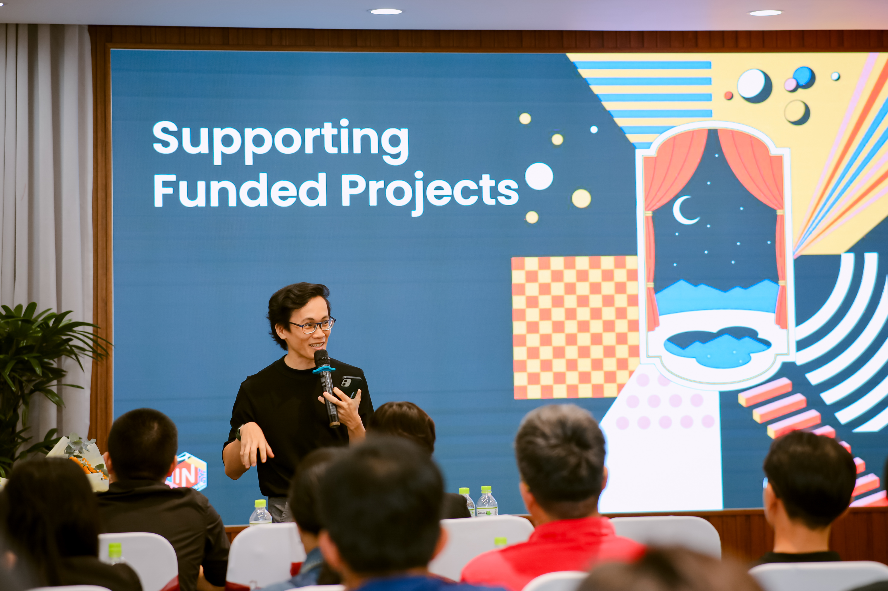
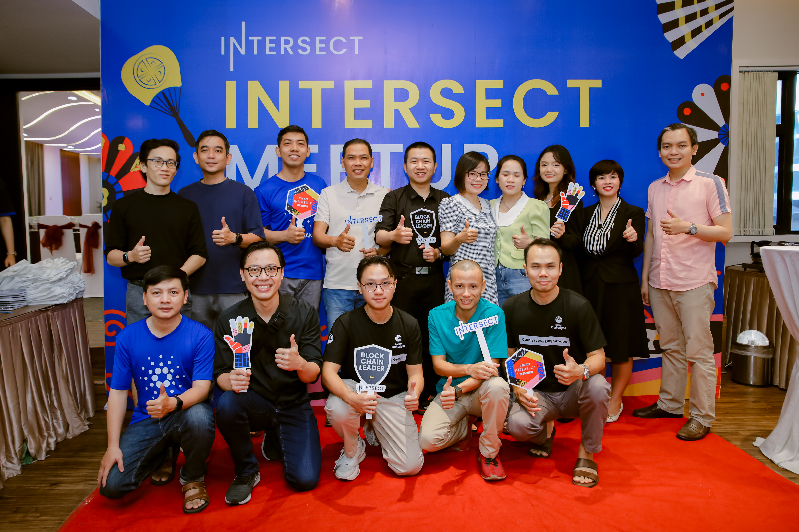
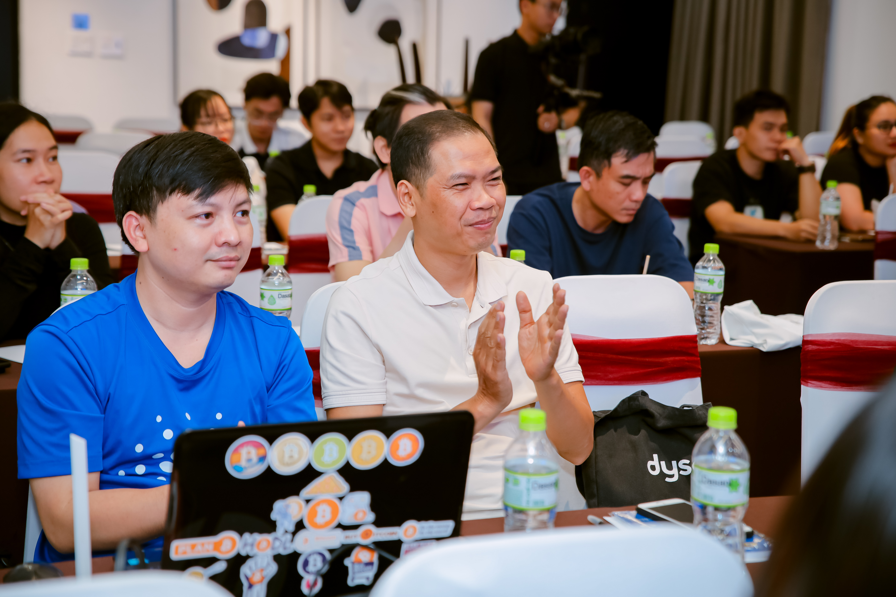

# Ho Chi Minh City, Vietnam - 21st July 2024

* Date of the event : Sunday, July 21, 2024&#x20;
* Time : 8:30 AM to 11:30 AM ICT
* Location : [VIEN DONG HOTEL](https://www.google.com/maps/search/?api=1\&query=10.84166%2C%20106.78362)
* Sign up [here](https://www.meetup.com/cardano-blockchain-ho-chi-minh-viet-nam/events/301773275/) !

## [Community meet-up Vietnam Blog](https://forum.cardano.org/t/recap-intersect-meetup-ho-chi-minh-vietnam-21-7-2024/134367?u=hakochan)

On July 21, 2024, the first Intersect Meetup in Vietnam was held in Ho Chi Minh City at Vien Dong Hotel with the participation of over 35 attendees

At the event, the Cardano Vietnam community and guests explored the following topics:

* &#x20;_Decentralized Governance on Cardano - CIP1694_
* _Overview of Intersect_
* &#x20;_The Five Core Pillars of Intersect_
* _Updates on Intersect’s Activities and Grants_
* _Opportunities with Intersect_
* _Instructions for Registering for Intersect Membership_



<figure><figcaption></figcaption></figure> <figure><figcaption></figcaption></figure>

<figure><figcaption></figcaption></figure>

<figure><figcaption></figcaption></figure> <figure><figcaption></figcaption></figure> <figure><figcaption></figcaption></figure>

<figure><figcaption></figcaption></figure>
