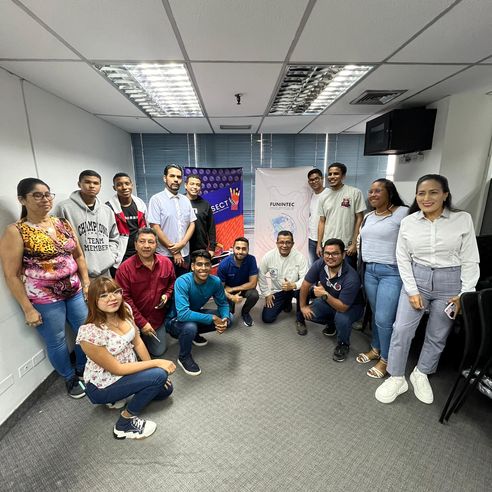
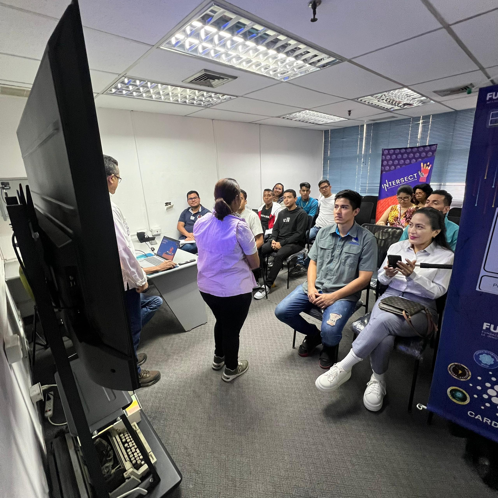
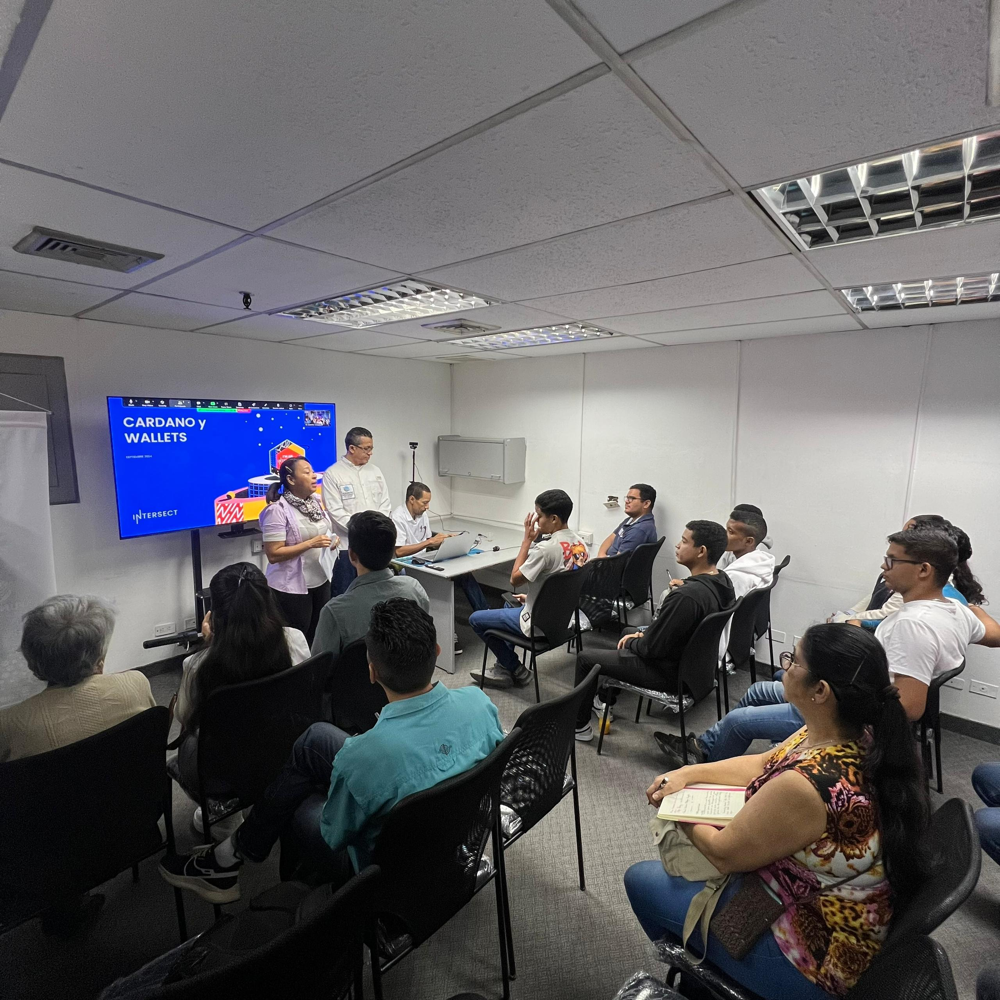
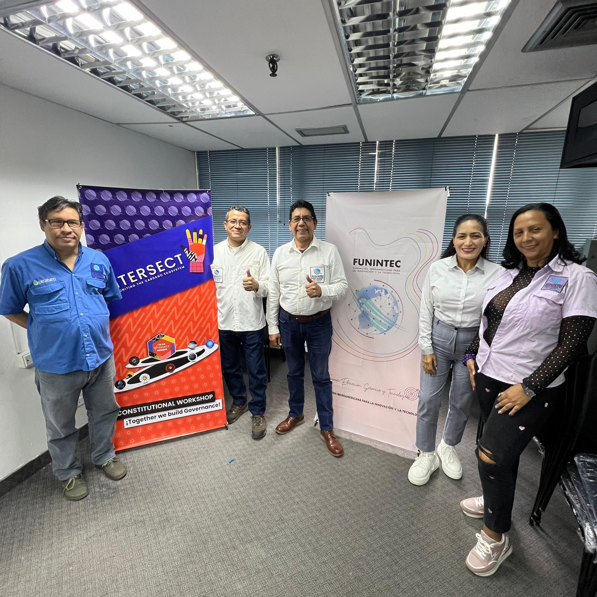
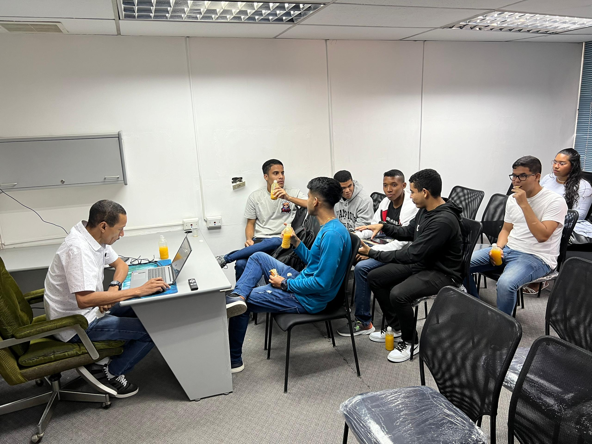

# Puerto La Cruz, Venezuela - 14th September 2024

## [Community Meet Up in Brazil blog](https://blog.funintec.net/)

On September 14th, 2024, an Intersect Meetup in Venezuela was held in Puerto La Cruz. The event featured insightful presentations from key Cardano representatives, who shared the vision, structure, and scope of the INTERSECT initiative. Attendees also learned about exciting business opportunities through FUNINTEC CARDANO, with expert guidance on how to invest in Cardano and become involved in Stake Pool Operations (SPO). The event was a valuable experience for those looking to engage with blockchain innovation and drive economic growth in Venezuela.

Main speakers:

* Dr. JOSE VILLALBA
* WILMER MALE
* JEAN CARLOS AGUILA
* JOSE ERASMO COLMENARES

<figure><figcaption></figcaption></figure>

<figure><figcaption></figcaption></figure> <figure><figcaption></figcaption></figure>

<figure><figcaption></figcaption></figure> <figure><figcaption></figcaption></figure>

<figure><figcaption></figcaption></figure>
