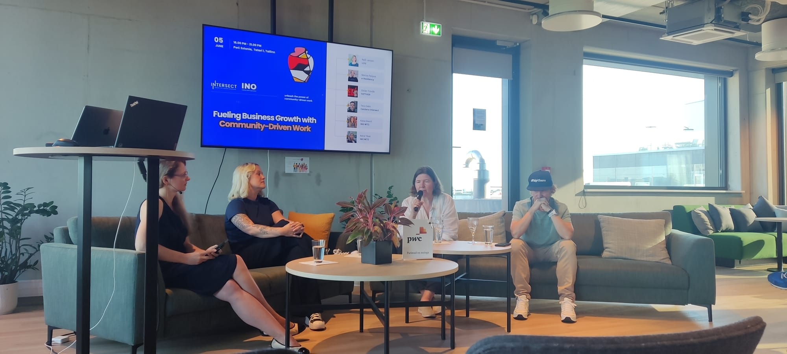
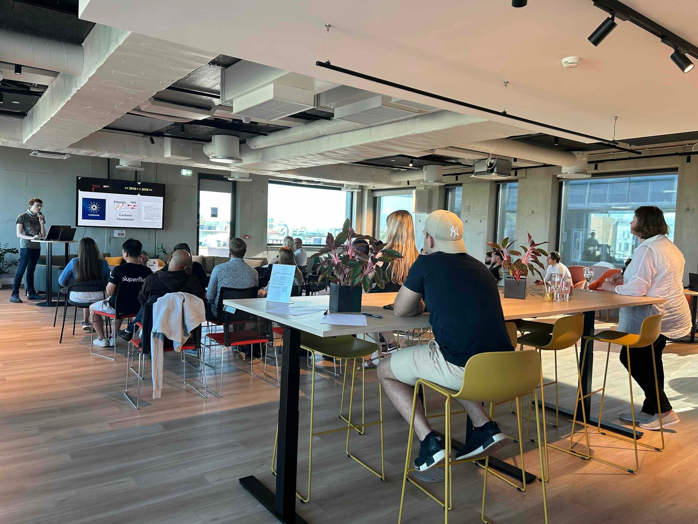

# Tallinn, Estonia - 5th June 2024

On June 5th, 2024, the [Internet Native Organization](https://internetnative.org/about) (INO NPO) and [Intersect](https://www.intersectmbo.org/?ref=internetnative.org) hosted an inspiring event titled "Fueling Business Growth with Community-Driven Work" at PwC Estonia in Tallinn.&#x20;

## [Community meet-up in Estonia blog](https://internetnative.org/fueling-business-growth-with-community-driven-work/)

<figure><figcaption></figcaption></figure>

<figure><figcaption></figcaption></figure>

<figure><figcaption></figcaption></figure>

