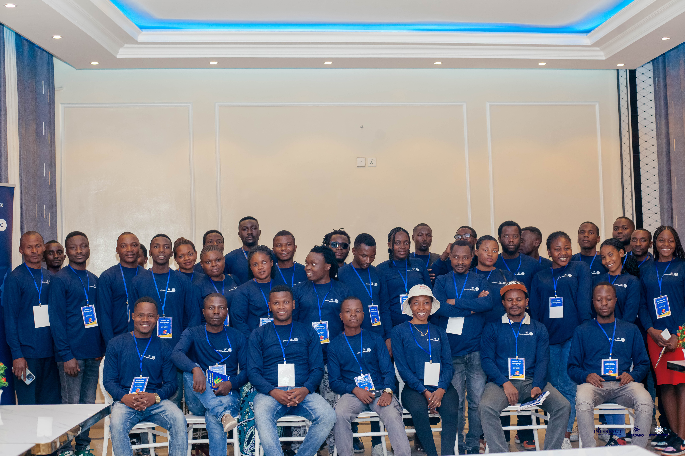
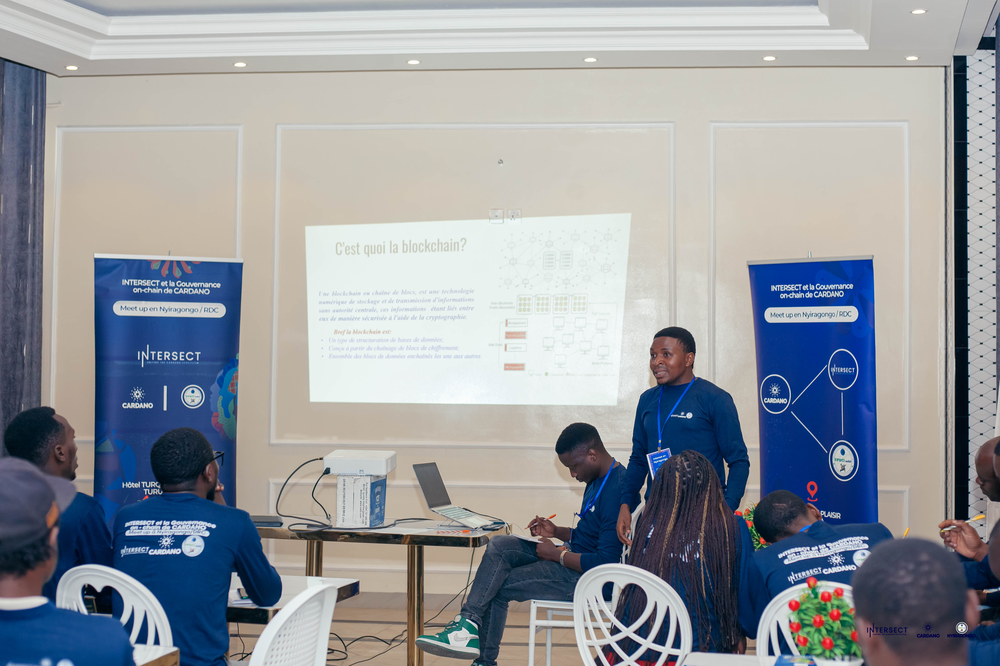
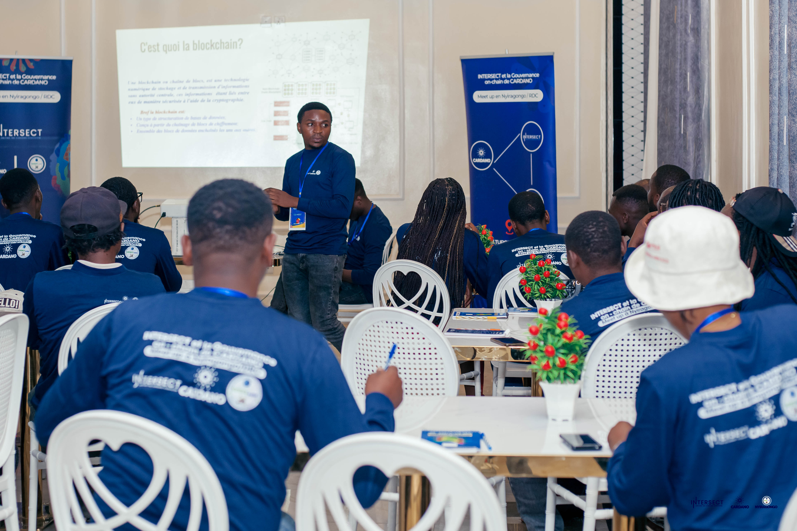
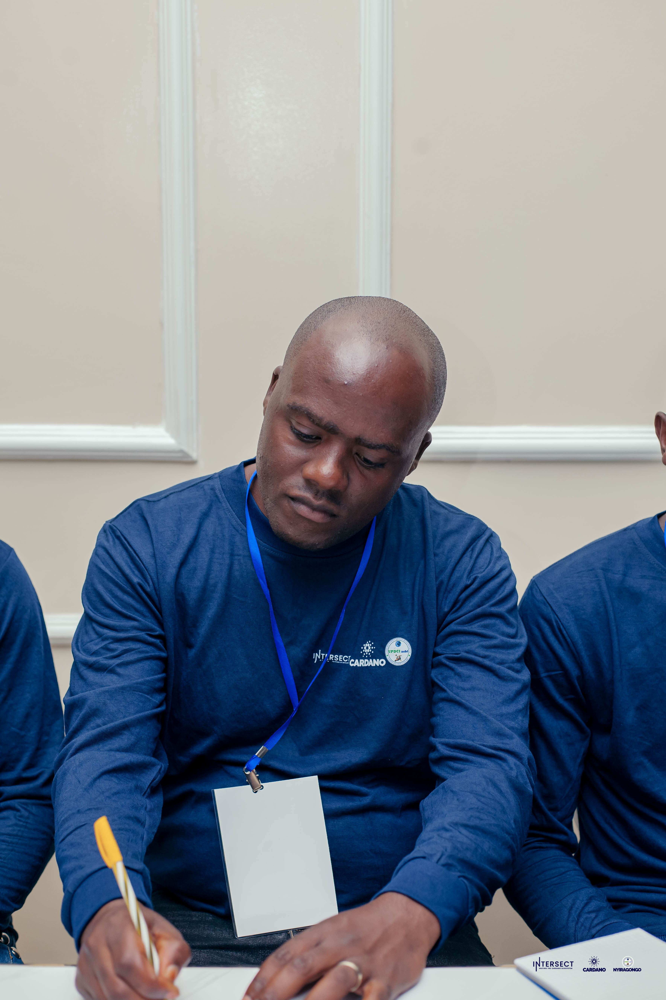
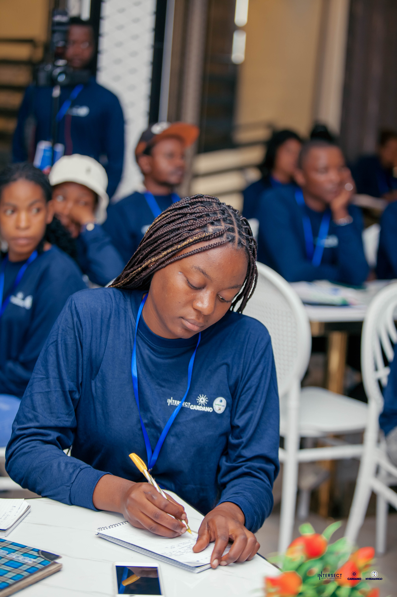
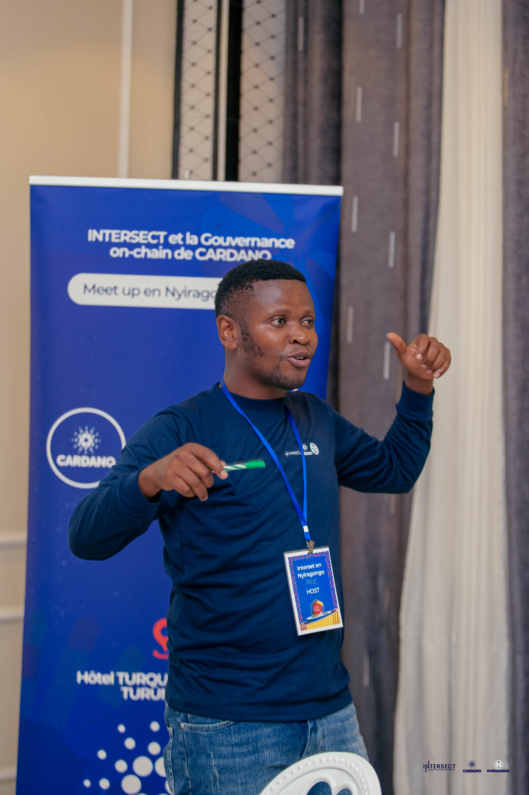

# Territory of Nyiragongo, Democratic Republic of Congo - 29th June 2024

Sign up here: [https://lu.ma/e9i3bncp](https://lu.ma/e9i3bncp)

<figure><figcaption></figcaption></figure>

On June 29th, 2024, Baudouin Muvunga hosted an inspiring event titled "On-chain governance of Cardano and Intersect MBO" in Nyiragongo territory,Democratic Republic of Congo.

## [Community meet-up in Nyiragongo,DRC Blog](https://updciongandintersectmboenglish.blogspot.com/2024/07/event-on-june-29-2024-in-nyiragongo.html)

<figure><figcaption></figcaption></figure>

<figure><figcaption></figcaption></figure> <figure><figcaption></figcaption></figure>

<figure><figcaption></figcaption></figure>

<figure><figcaption></figcaption></figure> <figure><figcaption></figcaption></figure> <figure><figcaption></figcaption></figure>

