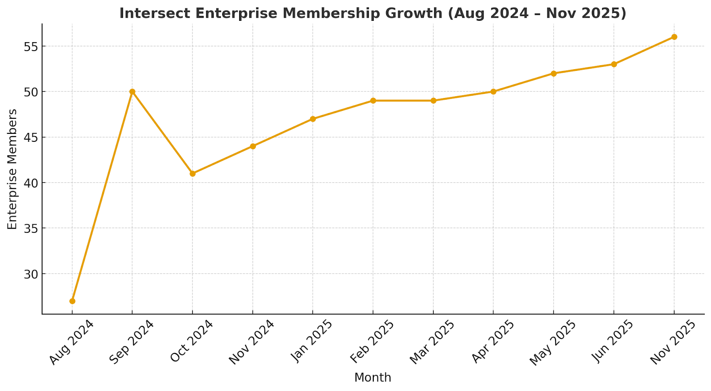

# Intersect Development Update - 2025 Report

## Introduction

Welcome to the Intersect Annual Report for 2025. This year marked a significant phase in Cardano's evolution, as it transitioned from a foundational setup to full community governance and implementation. Building on the infrastructure established in 2024, Intersect focused throughout 2025 on ensuring the lasting continuity and progressive development of the Cardano ecosystem through member empowerment and effective infrastructure management.

The year 2025 commenced with significant milestones, including the scheduled Plomin upgrade, which unlocked the final features of Cardano’s on-chain governance. Following this technical advancement, the delegate-approved constitution was submitted for on-chain community consideration in January 2025. Our collective efforts, in collaboration with members and the broader community, centered on refining and finalizing a sustainable budget for Cardano.

We are grateful to our members whose insights and active participation continue to drive our mission forward, ensuring Intersect remains an effective, transparent, and responsive organization.

***

## Letter from the Board

Dear Members, Partners, and Contributors of the Cardano Ecosystem,

2025 has been a defining year in the evolution of both Cardano’s governance and Intersect’s role as its member-based organisation. As the ecosystem transitioned from foundational design to full operational governance, our collective focus shifted from preparing the system to proving it. The successful implementation of the Plomin upgrade, the submission of the delegate-approved Constitution, and the execution of Cardano’s first community-led Treasury budget together marked a historic maturation of decentralized decision-making.

Throughout this pivotal year, Intersect has worked to ensure that community intent is translated into reliable, transparent, and accountable action. Administering the ecosystem’s first full Treasury cycle required the integration of legal, technical, administrative, and oversight functions at a scale never before attempted in the Cardano ecosystem. Through global listening sessions, workshops, and the coordinated execution of 39 Treasury withdrawals, Intersect helped operationalize a budgeting process defined not by central authority, but by the collective priorities of ADA holders. The establishment of a smart-contract–based payment framework and strengthened delivery assurance processes now provide a durable foundation for future Treasury cycles.

2025 also marked significant progress in Intersect’s internal governance. Committees became fully elected bodies, the Board transitioned to a member-elected majority, and enhancements were introduced to our election processes, rewards structures, and decision-making frameworks. These changes underscore a central principle: Intersect MBO exists to serve its members and to strengthen the democratic integrity of Cardano’s governance.

We also saw the evolution of Intersect’s membership landscape, from growth in numbers to growth in depth. While renewal cycles and governance fatigue were natural throughout the year, participation across working groups, committees, workshops, X Spaces, Town Halls, and in-person gatherings deepened meaningfully. These engagements reaffirmed a consistent theme: participation thrives when people feel informed, welcomed, and empowered to contribute.

The year also highlighted the growing resilience of Cardano’s infrastructure. During the recent temporary chain fork incident, Intersect played an important coordinating role, supporting clear communication, aligning ecosystem actors, and helping ensure that the chain remained stable and the community well-informed. Building on this, foundational work has already begun to strengthen core primitives and essential infrastructure for 2026, with Intersect serving as an anchor point to ensure these efforts reflect community priorities and are delivered with transparency.

Looking ahead to 2026, our priorities are clear. We will continue to simplify engagement pathways, reinforce our administrative and smart-contract infrastructure, expand support for open-source resilience, and deepen our work across global communities. Most importantly, we remain committed to ensuring that Intersect MBO continues to operate as a facilitator of community will, an organisation defined not by centralisation, but by service, transparency, and accountability.

On behalf of the Board of Directors, we extend our sincere gratitude to every member, contributor, builder, DRep, SPO, partner, and volunteer whose dedication shaped 2025. Your work, passion, and vigilance are the reason Cardano’s governance is no longer an aspiration, but a living, functioning system.

Together, we look forward to building on this year’s progress and continuing the shared journey toward a resilient, participatory, and globally impactful Cardano ecosystem. 

With appreciation,

The Intersect Board of Directors

Steven Lupien , Kavinda Kariyapperuma, Adam Rusch, Gérard Maroney, Nikhil Joshi, Mercy Fordwoo, Rand Mchenry&#x20;

***

## Intersect 2025: objectives and milestones

2025 marked a transformative year for Cardano and for Intersect. Building on the foundations of 2024, the organization guided the network from preparation to full community governance. The [Plomin upgrade](https://docs.intersectmbo.org/cardano-facilitation-services/cardano-development/cardano-hardforks-and-upgrades/chang-upgrade) in January unlocked Cardano’s final governance features, enabling ada holders to make binding on-chain decisions. Shortly after, the delegate-approved Constitution was submitted for community consideration, completing the framework envisioned by [CIP-1694](https://www.1694.io/en).

Intersect’s role throughout the year was defined by continuity and delivery. The year’s progress was measured not only by technical milestones but also by the way members embraced their responsibility as stewards of Cardano’s future.&#x20;

Key objectives realized in 2025 included:

* Delivering Cardano’s budget: Focus was maintained on finalizing and executing the Cardano budget, ensuring sustainable funding for core initiatives and growth verticals.
* Enhancing on-chain governance: We committed to making participation easier and faster, improving support services, and enabling the community to leverage the full governance capabilities of the protocol.
* Fostering the developer ecosystem: We continued strengthening Cardano’s open-source resilience and innovation.
* Providing administration services through our innovative organizational structure to help bridge and operationalize Cardano’s constitutional principles, harness the power of the decentralized treasury, and provide oversight via transparent on-chain reporting back to Cardano’s community.
* Increasing elected roles: with all committee members and the majority of the board elected by Intersect members.

Significant milestones achieved in 2025:

* Plomin upgrade: The Plomin hard fork was implemented, completing Cardano's transition to full community governance, making all governance actions available for ada owners to decide the outcomes. The governance action for the Plomin hard fork was expected to be raised in December 2024, with community governance actors voting until January 2025.
* Constitution submission: The delegate-approved Constitution was submitted on-chain for broader community consideration in January 2025, following the Plomin upgrade.
* Second Committee elections: The second committee elections took place in April 2025, making Intersect’s committees fully elected bodies.
* Constitutional Committee (CC) elections: Intersect facilitated the elections for the Constitutional Committee in June 2025, as all seven interim CC seats were scheduled to be up for election in the summer of 2025, marking the end of the interim CC’s one-year term.
* Board election: to reach a majority elected board.&#x20;

***

## Intersect as administrator - activating on-chain governance.

In 2025, Intersect fully realized its role as the operational backbone of Cardano’s governance, turning constitutional principles into functioning systems that now support decision-making at scale. Acting as [Administrator](https://docs.intersectmbo.org/cardano-facilitation-services/cardano-budget/intersect-administration-services/intersect-as-an-administrator), Intersect delivered the first full year of end-to-end decentralized governance processes, enabling the community to move from constitutional theory to real execution across budget allocation, Treasury withdrawals, and delivery oversight.

This transition required combining technical engineering, governance design, and professional administration. Every process, supplier onboarding, documentation standards, milestone verification, accountability checks, and reporting, was rebuilt for openness, consistency, and traceability. The result is a transparent operating environment where community-driven decisions can be executed reliably and audited publicly.\
\
Intersect’s [administrative evolution](https://www.intersectmbo.org/news/intersects-role-as-budget-administrator-enabling-accountable-decentralization) in 2025 demonstrates that decentralized governance can be both democratic and disciplined. Community-made decisions can now be implemented through a professional system that provides transparency, accountability, and year-over-year predictability. The foundations laid this year will support a more streamlined, equitable, and scalable governance cycle in 2026 and beyond.

### Budget administration

The [2025 budget cycle](https://committees.docs.intersectmbo.org/intersect-budget-committee/archive/2025-budget-process) marked the first time the Cardano community collectively determined how Treasury funds should be deployed across infrastructure, research, and ecosystem growth. Intersect’s role was not to choose priorities but to enable the DReps to do so effectively.

Intersect supported each stage of the budgeting workflow through:

* process documentation and intake standards
* multilingual vendor engagement
* structured workshops and reconciliation sessions
* proposal refinement pathways
* coordination between committees, vendors, and DReps
* publication of all standards and processes in the Knowledge Base

Following the workshop and refinement stages, DReps used the Ekklesia governance tool to prioritize proposals. Forty proposals exceeded the participation threshold and advanced to the Budget Info Action, requesting 275 million ada. Ultimately, [39 proposals](https://www.intersectmbo.org/news/vote-now-39-cardano-treasury-proposals-await-drep-and-cc-approval) were submitted for individual Treasury withdrawals, and 37 (95%) achieved the required constitutional supermajority.

### Treasury withdrawals and contract administration

Once community approval was secured, Intersect oversaw execution, including supplier contracting, constitutional compliance checks, and the establishment of milestone-based accountability routes for each engagement.

A significant advancement in 2025 was the deployment of the Treasury Withdrawal smart contract framework, developed in collaboration with ecosystem partners. The contract links payments to measurable deliverables, ensuring funds are released only when milestones are verified. This system:

* produces an immutable record of progress
* reduces administrative overhead
* strengthens financial accountability
* aligns work products with constitutional expectations

All active projects now operate under this contract architecture, defining a precedent for decentralized, transparent Treasury management.

### Delivery Assurance

Delivery Assurance matured into a permanent oversight function in 2025. Initially established in 2024 to support continuity contracts, it has since expanded into a core capability that validates progress across all Treasury-funded work. Throughout the year, the team implemented standardized supplier reporting requirements, structured milestone evidence reviews, early risk and variance detection, monthly summaries to the Budget Committee, and clearly defined escalation pathways for delays or scope changes.

By combining administrative responsibilities with a formal assurance process, Intersect ensures that community-approved work is delivered to specification, on time, and in alignment with ecosystem priorities.

A key component of this work is the [Delivery Assurance Dashboard](http://bit.ly/TWDB), which provides the community with real-time visibility into every Intersect-administered project. The dashboard reflects Intersect’s milestone-based funding model, where vendors are paid only after milestones are verified and approved through established governance processes. This enables anyone to track progress at a glance, see which milestones have been met, which are under review, and where risks may be emerging.

**Smart Contracts and On-Chain Transparency**

In 2025, Intersect introduced a new smart-contract framework that moves key elements of Treasury-funded administration directly onto the blockchain. Following the enactment of Treasury Withdrawal governance actions, funds are transferred into the [Treasury Reserve Contract](https://docs.intersectmbo.org/cardano-facilitation-services/cardano-budget/intersect-administration-services/smart-contracts-as-part-of-our-administration/smart-contract-types#smart-contract-types) (TRC). This smart contract securely holds Treasury funds on-chain rather than with any single administrator. From there, vendor-specific smart contracts are instantiated using the relevant [UTXOs](https://iohk.zendesk.com/hc/en-us/articles/900005930046-Understanding-Cardano-transactions-and-the-Cardano-Explorer), embedding each project’s delivery schedule, milestones, payment dates, and amounts into an auditable on-chain structure.\
\
**Milestone Verification and On-Chain Accountability**

Once a vendor smart contract has been signed,  through a multisignature process involving Intersect, the independent oversight committee, and the vendor, its milestone schedule becomes active. When a milestone matures, the vendor withdraws payment directly from their contract instance, generating a transparent, verifiable record that links each withdrawal to the TRC and the original governance action. This creates a transparent chain of accountability from Treasury allocation to milestone payment, strengthening transparency and laying the foundation for increasingly automated Delivery Assurance processes in future funding cycles.

***

## Committees and working groups

In 2025, Intersect’s [committees and working groups](https://docs.intersectmbo.org/intersect-overview/intersect-committees) became the backbone of Cardano’s operational and governance machinery. Now fully elected, they strengthened legitimacy, representation, and community ownership across all decision-making. Together, they provided the structure and expertise needed to support a maturing governance system, coordinating technical development, open-source sustainability, budgeting, product strategy, and community engagement. Their working groups deepened specialist input, broadened participation, and ensured that complex topics were explored collaboratively, transparently, and in alignment with the [Cardano Constitution](https://cardano.org/constitution/).

Across 2025, Intersect’s committees:

* Strengthened internal governance, refining election processes, documenting decision-making pathways, and improving constitutional alignment.
* Delivered technical leadership, coordinating hard forks, shaping protocol evolution, and guiding security readiness.
* Activated Cardano’s first decentralized budget cycle, supporting DReps through proposal review, prioritization, and Treasury oversight.
* Built sustainable open-source foundations, unifying governance, contributor frameworks, and lifecycle models across Intersect-managed projects.
* Advanced long-term strategic vision, developing Cardano’s first community-led vision, mission, and roadmap for 2030.
* Improved governance participation, enabling optional DRep compensation, strengthening Constitutional Committee processes, and amplifying ecosystem dialogue.
* Expanded community engagement, through surveys, events, research initiatives, and regional feedback loops.

What follows is a summary of each committee’s contributions throughout 2025, a year defined by deeper community participation, clearer governance structures, and the collaborative work required to support Cardano’s accelerating evolution.

### Intersect Steering Committee

The [Intersect Steering Committee](https://committees.docs.intersectmbo.org/intersect-steering-committee) (ISC) focused on strengthening governance clarity, improving operational consistency, and reinforcing accountability across Intersect in 2025. As the organization transitioned into a fully elected governance structure, the ISC served as the anchor for process improvement and institutional maturity.

A significant milestone was the Committee Reward Policy, adopted in Q4 2025. This policy establishes a sustainable model for recognising the work of elected committee members and supports long-term participation across Intersect’s governance bodies.

Alongside this, the ISC completed a comprehensive Intersect Decision-Making Framework, scheduled for publication at year’s end. This framework provides a unified reference for evaluating, escalating, and approving decisions across working groups, committees, and the Board, bringing greater transparency and predictability to Intersect’s internal governance.

The ISC also implemented enhancements to [Board and Committee election](https://docs.intersectmbo.org/intersect-membership/intersect-voting-events/intersect-elections-2025) processes, incorporating recommendations from the Governance Working Group. These improvements strengthened verification, clarified eligibility, and increased fairness and transparency across all election cycles, supporting the smooth execution of the April and October committee elections and the expanded Board election.

#### Looking Ahead

In 2026, the ISC will focus on refining the decision-making framework, improving cross-committee coordination, reviewing the initial rollout of the Reward Policy, and continuing to strengthen governance safeguards as Intersect’s membership and responsibilities grow. The committee remains committed to providing clear, stable structures that support Cardano’s maturing governance ecosystem.

### Technical Steering Committee

The [Technical Steering Committee](https://committees.docs.intersectmbo.org/intersect-technical-steering-committee) (TSC) played a critical role in maintaining Cardano’s technical stability and advancing protocol development throughout 2024–2025. Its work spanned hard fork coordination, security readiness, protocol improvements, and long-term technical planning.

#### Hard Fork Coordination & Protocol Upgrades

A significant milestone was the Plomin hard fork to protocol version 10, completing the activation of [CIP-1694](https://www.1694.io/en) governance. The TSC coordinated parameter-setting, technical guardrails, and ecosystem readiness, while also managing a security incident over the December holiday that required urgent SPO upgrades to [node 10.1.4](https://github.com/intersectmbo/cardano-node/releases).

To strengthen future processes, the TSC created a Hard Fork Working Group (HFWG), now preparing Protocol Version 11 for Q1 2026. This upgrade includes significant Plutus improvements, BLS/M2M cryptography, and UPLC optimizations, delivering an expected 40–60% performance gain. Early planning has also begun for Protocol Version 12 and the upcoming Dijkstra ledger era.

#### Security & Crisis Management

Working with the Security Council, the TSC formalized disaster-recovery procedures through [CIP-135](https://cips.cardano.org/cip/CIP-0135) and tested “fire drill” recovery scenarios, such as no-block production and bad-block injection on SanchoNet. These exercises produced validated recovery methods for mainnet-level incidents.

The December 2024 vulnerability further highlighted the need for improved communication channels, leading to strengthened coordination processes and plans for a dedicated incident-support function within Intersect.

#### Governance Integration & Parameter Improvements

The TSC ensured protocol changes remained constitutionally compliant while improving developer experience. Key updates included increases to Plutus memory execution units and expanding on-chain capacity. All changes followed formal governance notice periods and technical guardrails.

The committee also defined transparent processes for technical assessments of governance actions, supporting DReps, the Budget Committee, and Treasury Withdrawal reviews.

#### Technical Leadership & Ecosystem Collaboration

The TSC provided oversight across multiple technical domains, including repository stewardship (e.g., io-sim, typed-protocols), expansion of working groups, and participation in core research and ecosystem workshops such as Leios, Peras, node diversity, UPLC, and governance strategy sessions.

Committee members also offered technical guidance to DReps and Constitutional Committee members, ensuring governance decisions remained grounded in protocol realities.

#### Network Coordination

Across major [node releases](https://github.com/intersectmbo/cardano-node/releases), including 10.1.4, 10.5.1, and 10.6, the TSC coordinated communication, testing, and SPO guidance. The committee contributed to improvements in LMDB performance, memory optimizations, and network reliability.

#### Strategic Planning

The TSC contributed to Cardano’s 2030 strategic direction by advocating for capability-focused development and maintaining flexibility across emerging research tracks. Cross-committee collaboration with the Product and Open Source Committees helped align technical priorities, community needs, and budget constraints.

#### Looking Ahead

The TSC enters 2026 as a mature technical governance body with transparent processes, strong community engagement, and a stable foundation for future protocol evolution. Key priorities include:

* Deploying Protocol Version 11
* Strengthening disaster-recovery and incident-response capabilities
* Ongoing parameter and performance optimization
* Continued technical review of funded and ecosystem-wide initiatives
* Expanding open technical workshops and community engagement

Through its structured, collaborative approach, the TSC continues to ensure that Cardano’s technical foundations remain secure, efficient, and aligned with decentralized governance.

### The Cardano Budget Committee

The [Cardano Budget Committee](https://committees.docs.intersectmbo.org/intersect-budget-committee) (CBC) is an advisory committee that brings together relevant stakeholders from within the Cardano Ecosystem. The purpose of the budget committee is to use the knowledge and observations of these individuals to provide guidance, support, and oversight for Cardano’s annual budget processes.

The [2025 budget cycle](https://www.intersectmbo.org/news/cardano-budget-committee-recommendation-threshold-to-include-a-proposal-in-the-budget-info-action) represents a landmark in Cardano’s governance evolution: the first time that budget authority moved entirely from founding entities to the community’s Delegated Representatives (DReps). The Budget Committee’s role throughout the year was to provide the structure, documentation, and process integrity required to make this transition both functional and credible.

#### Origins: From governance theory to operational reality

The 2025 budgeting framework was developed from the work of the Cardano Civics Committee in 2024. Their governance whitepaper established the core requirements for a decentralized budgeting cycle, including:

* a predictable annual process
* standardized documentation
* stages for intake, refinement, prioritization, and ratification
* clear boundaries and constraints
* principle of DRep-led prioritization

This framework was then refined through major governance workshops in London and Florida, where stakeholders collectively stress-tested assumptions, defined quality standards, and developed the procedural blueprint that Intersect later operationalized.

#### Building the environment for DRep-led decision-making

As Cardano prepared for its first DRep-led budgeting year, the Budget Committee focused on enabling, not influencing, the prioritization process. This included creating:

* intake requirements and documentation templates
* process timelines and decision gates
* clarity around vendor expectations
* guidance for workshops, presentations, and refinement
* alignment with the [Product Committee roadmap](https://committees.docs.intersectmbo.org/intersect-product-committee/committee-outcomes/2025-cardanos-roadmap)

The roadmap proved essential. It established ecosystem-scale priorities for the upcoming year and ensured that DReps evaluated proposals within a shared strategic frame rather than in isolation.

**Supporting transparency and comparability**

The Budget Committee organized early-year workshops to enable direct dialogue between vendors and DReps. These sessions improved clarity, ensured proportional scrutiny, and significantly raised the maturity level of proposals entering the prioritization phase.

The Committee also oversaw the publication of all process materials, templates, checklists, and governance guides through the Intersect Knowledge Base, providing a permanent public record of how decentralized budgeting is executed.

**What we learned**

The 2025 process demonstrated that decentralized budgeting is viable, scalable, and strengthened by community participation. Key lessons include:

* standardization is critical; uneven proposals cannot be prioritized fairly
* interactive workshops are more effective than a written-only review
* roadmap anchoring prevents fragmentation
* process transparency increases community trust
* explicit constraints strengthen decentralized prioritization

**Looking ahead to 2026**

Based on 2025’s findings, the Budget Committee will introduce improvements that include:

* streamlined vendor intake and documentation
* more explicit prioritization guidance and dispute-resolution routes
* additional governance tooling for DReps
* improved multilingual pathways
* enhanced visibility of milestone progress and proposal health

The 2025 cycle laid the groundwork for a more predictable, scalable, and globally inclusive budgeting system. The 2026 cycle will deepen this maturity, widening participation while strengthening the structural guardrails that enable decentralized budgeting.

### Open Source Committee and Office

The [Open Source Committee](https://committees.docs.intersectmbo.org/intersect-open-source-committee) (OSC) is a decision-making committee that brings together relevant stakeholders from within the Cardano Ecosystem. The purpose of the OSC is to leverage the knowledge and observations of these committee members to provide guidance, support, and oversight for Intersect's open source initiatives, ensuring alignment with overall business objectives.

#### Governance Structure & Operational Maturity

The OSC formalised its charter, election processes, and oversight responsibilities, transforming open source into a structured governance function. What began as loosely coordinated volunteer work is now a cohesive system that allocates budgets, guides strategy, and ensures open-source assets remain community-owned public goods.

#### Contributor Pathways & Incubation

A key milestone was the introduction of clear contributor and maintainer pathways, enabling newcomers and experienced contributors to progress with transparency and support. These ladders and incubation stages will be rolled out across all Intersect-supported repositories, providing consistent standards for project growth, mentorship, and sustainability.

#### Project Maturity Framework

The OSC developed and piloted a maturity model to assess documentation quality, technical health, and governance visibility across projects. These assessments now serve as a standard benchmark for risk management and a structured roadmap for project improvement through Intersect’s lifecycle framework.

#### Working Groups & Ecosystem Collaboration

Three OSC working groups, Tooling, Developer Experience, and Commercialization, advanced practical outputs and strengthened collaboration with partners such as the [Chinstrap Community](https://chinstrap.community/), [Bitergia](https://bitergia.com/), the [TODO Group](https://todogroup.org/), and [LFDT](https://lf-decentralized-trust.github.io/governance/project-updates/2025/2025-Q3-Hyperledger-Identus/). These partnerships help ensure Cardano’s open-source practices align with global [OSPO](https://github.com/IntersectMBO/Open-Source-Office) standards.

#### Paid Open Source Model (POSM)

The OSC continued rolling out the [Paid Open Source Model](https://www.intersectmbo.org/news/the-paid-open-source-model), introducing a structured approach to compensating maintainers of Cardano-critical tools and libraries. This program is already attracting attention across the blockchain industry as a model for sustainable open-source funding.

#### Ecosystem Impact

* Transparency: Policies, budgets, and maturity assessments are now openly published.
* Repeatable infrastructure: Open-source delivery now relies on standards and systems, not individual heroics.
* Cross-ecosystem adoption: Contribution ladders and maturity frameworks are increasingly referenced beyond Intersect.
* Membership value: Each incubated project, working group, and assessment directly benefits the community that funds this work.

#### Looking Ahead

In 2026, the OSC will focus on long-term stability and ecosystem-wide transparency, including:

* Scaling the contribution ladder and recognition systems for maintainers
* Launching a Contributor Observatory dashboard
* Expanding POSM to additional Cardano-critical repositories
* Formalising security and compliance within open-source governance
* Strengthening partnerships with global OSPO networks

Cardano’s open-source ecosystem now stands on solid foundations. The shift from the “cowboy era” to a coordinated operations centre marks a significant milestone, ensuring Cardano’s core infrastructure remains open, trusted, and built for the long term.

### Cardano Product Committee

The [Cardano Product Committee](https://committees.docs.intersectmbo.org/intersect-product-committee) made significant progress in 2025 by initiating the ecosystem’s first community-led long-term vision and annual roadmap. This work sets the foundation for a unified direction for Cardano, shaped directly by businesses, builders, members, and DReps.

#### Ecosystem Input & Research

Starting in late 2024, the committee established a structured process to gather insights from across the ecosystem. Input was sourced through business interviews with global organisations, including banks and brands such as Vodafone and Hublot, as well as local gatherings, in-person and remote workshops, and open surveys. This marked the first coordinated product research effort for Cardano.

#### Developing the 2030 Vision & Strategy

With DRep support and budget allocation, the committee transformed this research into a first draft of the [Cardano 2030 Vision](https://product.cardano.intersectmbo.org/vision/strategy-2030/) and Strategy. Through multiple iterations, refined via global workshops in Colombo, Nairobi, Singapore, Osaka, Tokyo, Barcelona, Cameroon, and beyond, the committee converged on a single Vision Statement, Mission Statement, and Strategy Document.

These drafts were shaped through a blend of enterprise insights, community feedback, and builder perspectives, ensuring broad representation and real-world applicability.

#### Path to On-Chain Approval

Once sufficient community consensus is reached, the long-term vision and strategy will be submitted on-chain for DRep approval. If ratified, they will become guiding documents for future processes, including budgeting, roadmap alignment, and ecosystem coordination.

#### Expanding Product Research

Alongside this work, the committee began rolling out an open grant process to support community-led product research. This initiative decentralises insight generation and provides new avenues for contributors to influence Cardano’s future direction.

#### Looking Ahead

In 2026, the Product Committee will focus on completing community consensus for the 2030 Vision and submitting it for on-chain approval. The committee will also expand its product-research grants, strengthen collaboration with other committees, and begin shaping the first community-led annual roadmap informed by the long-term strategy. These efforts will help ensure Cardano’s future development remains coordinated, community-driven, and aligned with shared strategic goals.

### Cardano Civics Committee

The [Civics Committee](https://committees.docs.intersectmbo.org/intersect-civics-committee) focused on strengthening Cardano’s governance by improving transparency, communication, and accessibility across the ecosystem. Building on lessons from the Constitution process, the committee prioritised making governance more straightforward to understand and more inviting for members, DReps, SPOs, and builders, ensuring participation remained informed, confident, and representative.

#### Strengthening Governance Understanding & Participation

Throughout the first complete DRep-led budget cycle, Civics supported DReps and SPOs by providing clear explanations of responsibilities, simplifying voting timelines, and engaging directly with the community at events. This work helped ensure that participation in governance processes was grounded in shared understanding rather than technical complexity.

The committee also completed its 2025 charter, outlining five priority areas:

* Constitution ratification and future constitutional amendments
* Governance, health, and governance education
* Civics input to the Cardano budget
* Enabling the Constitutional Committee elections
* Supporting a model for DRep compensation

These focus areas shaped the committee’s year and clarified expectations for community engagement.

#### Working Groups & Community Collaboration

To keep their work open and participatory, Civics oversaw dedicated working groups and encouraged contributions from community members and subject-matter experts.

The Governance Health Working Group explored how Cardano measures and improves the health of its governance systems. Through the development of Governance Health Dashboard requirements, community feedback rounds, and plans for a public campaign to publish the DRep rationale, the group promoted continuous improvement and transparency.

The Constitutional Committee Election Working Group guided the transition from the Interim Constitutional Committee to a fully community-elected body. Its work focused on fairness and clarity, including reviewing the ICC process, recommending improvements to registration and candidate expectations, strengthening voter education, and developing documentation to support rotation and handover. These efforts were designed to enhance trust in the network's constitutional guardianship.

#### Amplifying Governance Communication

Throughout the year, Civics helped lead more than 40 X Spaces covering Constitutional Committee elections, Intersect Committee elections, budget education, and governance tooling. These sessions allowed candidates to speak directly to members and gave voters opportunities to ask questions in real time, reinforcing transparent, two-way communication.

Civics also supported the rollout of optional DRep compensation under CIP-149 by promoting grants for wallets, SDKs, and other tooling, while ensuring the community understood how compensation models can strengthen long-term DRep participation.

#### A Year of Openness & Collaboration

Across all its initiatives, the Civics Committee consistently championed openness, accessibility, and collaborative governance. By improving communication, supporting community participation, and reinforcing clarity around constitutional and governance processes, the committee strengthened Cardano’s governance culture and aligned it with the needs of a global ecosystem.

### Growth and Marketing Committee

The [Growth and Marketing Committee](https://committees.docs.intersectmbo.org/intersect-growth-marketing-committee) (GMC) was formally established in early 2025 to strengthen the ecosystem’s global visibility and to coordinate community-led marketing efforts across Cardano. As a newly created committee, much of the year was spent laying the groundwork, defining its mission, vision, charter, and operating processes, and beginning to support a more unified marketing approach within a decentralized environment.

#### Establishing Governance Foundations

During its bootstrap phase, the GMC developed a committee charter outlining its remit:

* enable collaboration among marketers, creators, and event organizers
* encourage cohesive messaging across the ecosystem
* gather insight into Cardano’s global marketing presence
* guide best practices for transparent, community-driven promotion.

This foundational work created a shared framework for how marketing initiatives can operate consistently across regions and audiences, while remaining open and community-first.

#### Marketing Landscape Research & Insights

A significant early milestone was the release of the Cardano Marketing Landscape Study, published during [Rare Evo](https://rareevo.io/) in August. This research captured community sentiment, highlighted marketing gaps, and mapped opportunities for broader ecosystem alignment. The study provided one of the most detailed looks to date at how the Cardano community perceives marketing effectiveness, coherence, and priorities.

Insights from the study were later presented during Day Zero at the [Cardano Summit](https://summit.cardano.org/), where community members engaged directly with GMC contributors to clarify marketing needs and discuss the future of Cardano’s promotional strategy.

#### Ecosystem Support & Community Engagement

Throughout the year, the GMC supported ecosystem promoters, event hosts, and marketers by offering guidance, feedback, and clearer coordination channels. This work helped reveal several challenges faced by regional communities, including inconsistent messaging, limited access to shared resources, fragmented promotional efforts, and frequent duplication of work.

To address these issues, the committee began drafting a revised marketing strategy informed by survey data, insights from workshops and community input sessions, and alignment with the ecosystem’s broader governance priorities. At the same time, the GMC continued to expand participation by actively encouraging marketers, designers, social hosts, and event organisers to contribute through open meetings and working sessions, thereby strengthening collaboration across the ecosystem.

#### Looking Ahead

In 2026, the Growth and Marketing Committee will focus on implementing a more structured and coordinated marketing approach across the ecosystem. Priorities include:

* Completing a community-informed marketing strategy and publishing recommended best practices
* Creating shared resources and templates to improve message consistency
* Supporting Cardano event organizers with more explicit guidance and coordination
* Strengthening collaboration with ecosystem projects, regional communities, and other Intersect committees
* Continuing research into the marketing landscape to track progress and evolving needs

As Cardano enters a new era of decentralized governance, the GMC’s work will help ensure that the ecosystem’s story is communicated clearly, consistently, and collaboratively across the globe.

### Membership and Community Committee

The [Membership & Community Committee](https://committees.docs.intersectmbo.org/intersect-membership-community-committee) (MCC) spent 2025 making participation easier, improving governance clarity, and strengthening the overall member experience. Early in the year, the committee refined its budget approach, aligned processes with Catalyst’s evolving model, and introduced more straightforward guidelines for async decision-making and working-group activity. MCC also supported the shift of town halls to a community–hub–led format, kept membership fees stable, and helped improve DRep engagement and communication on governance.

By mid-year, the committee finalised its remit and charter, set clearer expectations for participation, and onboarded new leadership roles. Its four-pillar roadmap, benefits, participation, recognition, and hub support advanced with the re-establishment of the Hubs Working Group, preparations for Fund 15, and the launch of new offerings, including office hours, member-led webinars, and enhanced enterprise packages.

With better tools, stronger communication, and closer collaboration across committees, MCC reinforced its role as the bridge between Intersect and its global membership.

#### Looking Ahead

In 2026, MCC will focus on deepening participation pathways and improving the member journey. Plans include expanding the Hubs Working Group, enhancing membership benefits, introducing new engagement tools in the Member Area, and improving governance understanding through more transparent communication and educational efforts.

The committee will also continue refining async decision-making and strengthening feedback loops to ensure membership remains accessible, meaningful, and aligned with the needs of the global Cardano community.

***

## Elections 2025

In 2025, Intersect held two successful rounds of committee elections, one in April and another in October, alongside the board elections, which also took place across the last quarter of the year, marking key milestones in the evolution of the organization’s governance model and member engagement.

#### Committee Elections summary&#x20;

The [April 2025 elections](https://www.intersectmbo.org/news/intersect-committee-election-results) demonstrated remarkable participation, with 118 candidates standing across all committees and 522 unique members casting their votes. This represented 27% of the eligible paying membership, a strong indicator of the community’s growing commitment to actively shaping Intersect’s future.

The [October 2025 elections](https://www.intersectmbo.org/news/intersect-committee-election-october-2025-results) maintained this momentum, attracting 98 candidates and 293 voting members, which accounted for 28% of the eligible paying membership. While the number of candidates decreased slightly from April, the participation rate among members remained high, indicating sustained engagement and interest in Intersect’s governance processes.

#### Board Elections summary

In September 2025, Intersect held its [Board Elections](https://www.intersectmbo.org/news/intersect-announces-results-of-2025-board-elections). For the first time, four board seats were open for election, expanding member representation compared to the previous year. The process allowed members to select four representatives to the seven-member Board, which is responsible for guiding Intersect’s strategic direction and ensuring it remains aligned with its mission and community values.

The elections concluded with strong community engagement, as 269 members cast their votes, representing 22% of all paying members. The four elected members were Adam Rusch (187 votes), Kavinda Kariyapperuma (179 votes), Mercy Fordwoo (143 votes), and Rand McHenry (126 votes). To ensure continuity and renewal, Mercy Fordwoo and Rand McHenry will serve a two-year term, while the remaining two will serve a one-year term.

 

***

## Membership and engagement

One of Intersect’s core goals in 2025 has been to make it easier for members to participate and contribute. Working groups and committees remain the primary avenues for meaningful involvement, so improving access to both elected seats and SME roles has been a significant priority. Open calls, Town Halls, X Spaces, and the Intersect Discord were refined throughout the year based on direct member feedback, ensuring clearer pathways into participation.

Member participation tools also continued to improve with a more transparent voting process, easier verification, and more intuitive election interfaces. Committees gained self-service tools to manage their own polls and chair elections, increasing transparency. To keep members informed, a new Updates section was added to the Member Area, allowing committees to post directly and members to tailor notifications.

#### Growing and Evolving the Membership

From January to June 2025, Intersect’s membership grew steadily from 4,397 to 4,825 registered members and associates across more than 110 countries. This expansion reflects not just wider adoption but deeper trust in Intersect as the home for Cardano’s governance and community collaboration. Enterprise membership passed the 50-organization milestone, while associate and individual memberships continued to grow, strengthening grassroots involvement in governance, working groups, and committees. As we entered the mid-year renewal phase, membership stands at 3,959 active contacts, including 834.

Alongside this growth, extra value was added through participation badges, NFTs, member-offered perks, and free customisable Clay avatars. Looking ahead, upcoming features will allow members to create and join working groups directly, access clearer committee information, benefit from enhanced enterprise visibility, and connect through the Intersect Virtual Hub launching at the 2025 Annual Member Meeting.

### Community Engagement

Throughout 2025, Intersect strengthened community participation through a blend of in-person events and online discussions. Workshops, governance debates, and local meetups helped members engage with key governance topics, including the constitution, committee structures, governance actions, and upcoming milestones. These sessions translated complex governance issues into accessible, locally relevant discussions.

Alongside this in-person activity, Intersect hosted around 40 X Spaces, reaching thousands of listeners across the ecosystem. These real-time conversations connected members directly. Topics covered included:

* Elections and candidate Q\&As
* Budget and proposal review processes
* CIP-149 and governance tooling
* Delivery Assurance and milestone clarity
* On-chain vs off-chain governance debates

Intersect team members and the Board engaged across community-hosted Spaces to support open dialogue, answer questions, and maintain transparency, ensuring members stayed informed and connected. Membership naturally recalibrated as renewals came into cycle, particularly among individual and Enterprise members. More importantly, 2025 marked a shift from growth in numbers to growth with purpose, supported by renewals, benefit upgrades, enterprise feedback sessions, and new initiatives like the Enterprise Forum, Community Town Square, and regional engagement efforts. These developments signal a more focused and value-driven membership ecosystem as we move through 2025 and look ahead to renewed expansion in 2026.

### Enterprise members&#x20;

Enterprise membership continued to strengthen throughout 2025, reflecting growing confidence in Intersect as the home of Cardano’s governance and ecosystem coordination. The program passed a key milestone early in the year, surpassing 50 active enterprise members, with steady onboarding from Web3 platforms, infrastructure providers, tooling companies, and ecosystem contributors across APAC, MENA, Europe, and North America. Engagement increased significantly through direct outreach, event participation, and the introduction of clearer communication channels tailored for enterprise partners.\
\
A clear industry breakdown shows a well-balanced and maturing enterprise ecosystem:

* Developer Tooling & Infrastructure: \~28%
* DeFi / RWA / Analytics: \~18%
* Enterprise Consulting / Legal / Compliance: \~17%
* DAO / Governance & Community Infrastructure: \~15%
* Wallets & Identity: \~12%
* NFT / Metaverse / Media: \~10%

This distribution demonstrates a strategically diverse enterprise network contributing to interoperability, identity, compute, governance, and emerging digital economies across Cardano.\
 

<figure><figcaption></figcaption></figure>

Here’s the growth pattern for Intersect’s Enterprise Membership (Aug 2024 → Nov 2025)&#x20;

* The count rose from 27 to 56, showing 107% growth in just over a year.
* A dip during conversion followed the sharp rise in September 2024 (Founding Membership phase), then a steady recovery across 2025.
* The trendline reflects stabilized and consistent growth post-Q1 2025, aligning with the renewed enterprise outreach and onboarding efforts.

***

## Global Events Presence in 2025

In 2025, Intersect strengthened its commitment to supporting, connecting, and empowering communities across the Cardano ecosystem. Through increased global presence, deeper regional collaboration, and participation in major technology, blockchain, and governance-focused events, Intersect expanded its reach and influence worldwide.

Our presence across Latin America, Japan, India, and Europe reinforced Cardano’s reputation as a transparent, collaborative, and globally connected ecosystem. Across more than 30 international events and workshops, Intersect engaged thousands of participants across the full spectrum of the Cardano community.

These engagements resulted in:

* Hundreds of new members
* Stronger enterprise partnerships
* Greater awareness of decentralized governance
* Global rollout of the 2030 Vision workshop\
  Deeper regional community ties

Intersect maintained a strong presence across a diverse set of global industry events, including:

#### Berlin - Cardano Summit

Engaging with the global Cardano community through presentations, workshops, and member-led discussions focused on governance, ecosystem growth, and the future of on-chain participation.

 

<figure><figcaption></figcaption></figure>

<figure><figcaption></figcaption></figure>

#### India – Developer Summits

Engagements with builders, students, and enterprises to promote decentralized governance and open-source collaboration.

<figure><figcaption></figcaption></figure>

<figure><figcaption></figcaption></figure>

#### Paris – Community Gatherings

Member-focused sessions combining workshops, discussions, and cross-border collaboration.

<figure><figcaption></figcaption></figure>

<figure><figcaption></figcaption></figure>

#### Tokyo, Japan – TEAMZ Blockchain Summit

Showcasing open-source governance and connecting with enterprise and policy audiences.

<figure><figcaption></figcaption></figure>

#### Hyderabad, India – Codex Conference

Technical discussions on governance innovation, accountability frameworks, and the future of on-chain decision-making.

<figure><figcaption></figcaption></figure>

<figure><figcaption></figcaption></figure>

#### USA – Rare Evo

Connecting with the global Cardano community, highlighting governance tooling, and supporting contributors across the ecosystem.

<figure><figcaption></figcaption></figure>

#### Japan – Tech for Impact

Presentations focused on responsible governance, ecosystem collaboration, and Cardano’s technical roadmap.

<figure><figcaption></figcaption></figure>

<figure><figcaption></figcaption></figure>

#### LATAM - Cardano tech summit

With over 300 attendees from all over Latin America, the Cardano Tech Summit LATAM opened the series of events for the Cardano Summit with an absolute blast!

<figure><figcaption></figcaption></figure>

<figure><figcaption></figcaption></figure>

#### Singapore – Token2049

Showcasing member-led governance and the importance of community-driven evolution in Cardano’s technology stack.

<figure><figcaption></figcaption></figure>

<figure><figcaption></figcaption></figure>

#### Barcelona – Blockchain x Culture (Nuluna Event)

Hosting a 2030 Vision Workshop exploring governance in creative and cultural contexts, expanding participation into new spaces and audiences.

***

## Final word

Intersect’s journey through 2025 has been one of transformation and proof. The systems built in previous years are now active, transparent, and community-owned. Governance on Cardano is no longer theoretical; it is lived daily by members, committees, and contributors around the world.

The coming year will build on this momentum. With the administrative framework in place, open-source programs thriving, and membership stronger than ever, 2026 promises to be a year of consolidation and growth. Intersect will continue to serve as the bridge between community vision and operational reality, ensuring that Cardano remains the most transparent and participatory blockchain ecosystem.

To every member, contributor, and partner who helped make 2025 possible, thank you. Together, we have built the structures of self-governance; now, we will watch them flourish.

 
