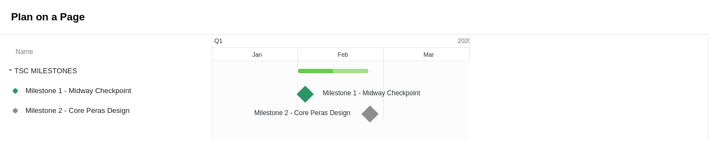

# Technical steering committee contracts

This page covers everything related to the contracts that were proposed by the community to be contracted via the Technical steering committee. _Note that some of these contracts were established through the original 2024 contracting process, with funding provided by the CDH. Any contracts awarded from June 2025 onward will be financed through the Treasury withdrawal, in alignment with the budget process._

## **Contract overview section**

<table data-full-width="true"><thead><tr><th width="114">Supplier</th><th width="141">Contract</th><th width="124">Contract Date</th><th width="439.333251953125">Contract Description</th><th width="130.3333740234375">Contract Status<select multiple><option value="gcTKZEIm6ZZA" label="Ongoing" color="blue"></option><option value="grsrfT4WRgQn" label="Complete" color="blue"></option></select></th><th>Contract Amount</th></tr></thead><tbody><tr><td>Tweag</td><td><a href="tweag-ouroborus-peras-protocol.md">Ouroboros Peras Protocol</a></td><td>01/12/2025 - 03/12/2025</td><td>The output of this SoW should consist of the necessary planning and design in order to carry out a prototype implementation of Peras integrated into the standard Cardano node.</td><td>Ongoing</td><td>$226,569</td></tr></tbody></table>

## Overview of current technical steering committee contractual milestones

<figure><figcaption></figcaption></figure>

