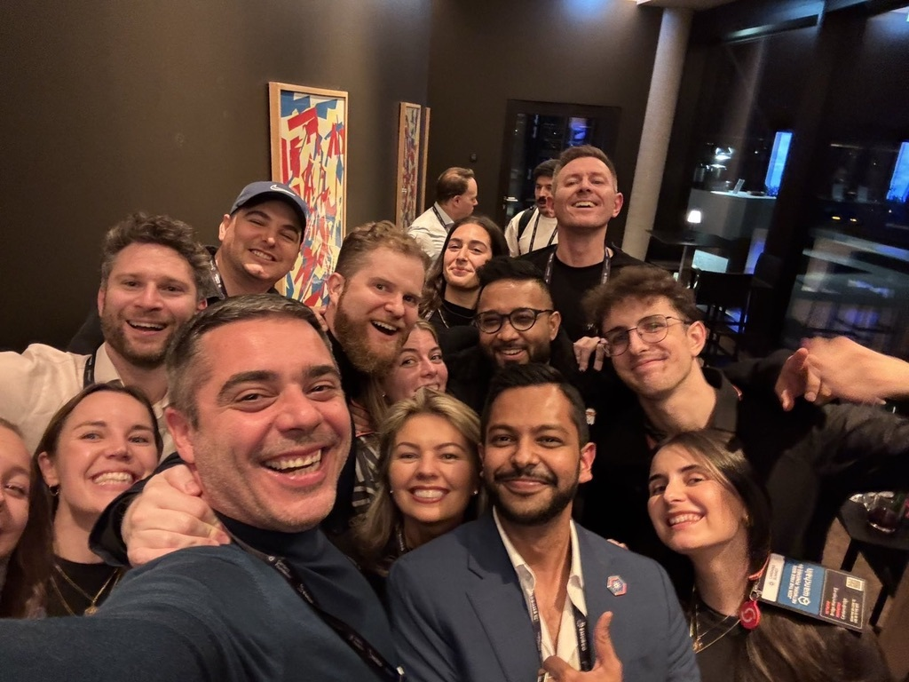
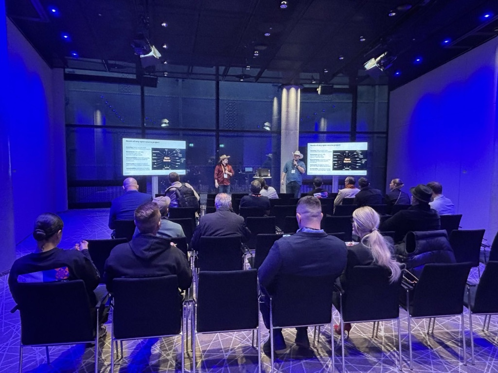
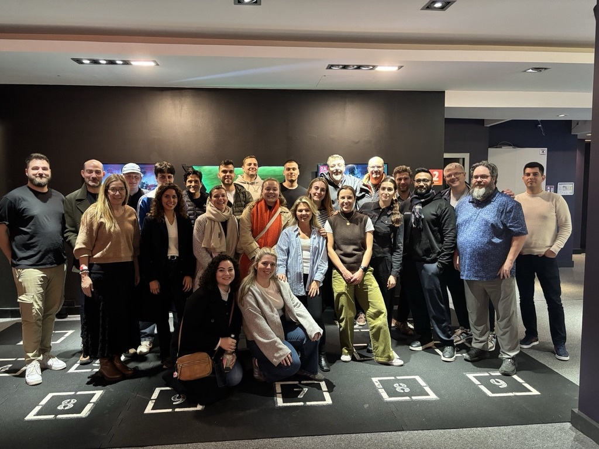
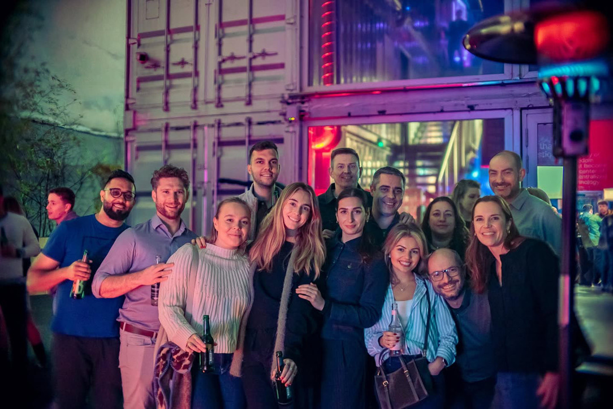

# Working at Intersect


**View our current open roles and apply** [**here**](https://intersect-mbo.firststage.co/jobs)**.**


## What is it like working at Intersect?

Working at Intersect means being part of a globally distributed, remote-first team. Our contributors are based across multiple countries and time zones, and we design our ways of working to support flexibility, autonomy, and trust.

We aim to create an environment where people can do meaningful work without sacrificing balance. That means clear ownership, decision-making close to the work, thoughtful collaboration and respect for deep focus alongside regular opportunities to connect, share context, and build relationships across the organization.

You’ll be working with people who care deeply about what they do, who are generous with their knowledge, and who are motivated by impact rather than ego. We encourage curiosity, constructive challenge, and continuous learning, especially in a fast-moving and evolving space like Web3.

<figure><figcaption></figcaption></figure>

## How do our teams enable success?

While our roles sit within specific sectors, much of our work happens cross-functionally, reflecting the interconnected nature of Intersect and the Cardano ecosystem.

**Operations:** Enabling the organisation to run smoothly and sustainably, covering finance, procurement, legal coordination, delivery assurance, planning, and operational support.

**People:** Supporting our people and culture across the full employee and contractor lifecycle. This includes organizational design, ways of working, leadership support, wellbeing, performance, and creating an inclusive, values-led environment where people can do their best work.

**Product & Membership:** Designing and delivering products, services, and experiences for Intersect members. This includes membership models, product development, value propositions, and ensuring members are supported, informed, and able to engage meaningfully with Intersect and the wider Cardano ecosystem.

**Ecosystem & Community:** Engaging with the wider Cardano community, supporting governance participation, working groups, events, communications, and ecosystem initiatives.

**Cardano Tech:** Collaborating with technical teams and contributors to support delivery, standards, and technical alignment across the Cardano ecosystem.

<figure><figcaption></figcaption></figure>

## Our Core Values

At Intersect, our core values describe how we work together, how we make decisions, and how we show up as stewards of the Cardano ecosystem. They are not aspirational slogans - they reflect the behaviours we actively expect, reinforce, and design our ways of working around.

#### **Integrity in Action**

We operate transparently and ethically with each other. This is the foundation of trust - internally and externally - and shows up through honest communication, clear decision-making, early escalation of risks, and following through on commitments.

#### **Collaborative Ownership**

We build together, share responsibility, and elevate the collective. Ownership at Intersect is not about hierarchy, but about stewardship; reducing silos, supporting one another, making decisions at the right level, and celebrating outcomes as a team.

#### **Purposeful Delivery**

We turn ideas into outcomes with focus, clarity, and discipline. This value balances creativity with execution, encouraging deep ownership, clear priorities, intentional planning, and closing the loop on delivery and learnings.

#### **Ecosystem First**

We champion Cardano’s people, projects, and progress in everything we do. Our decisions consider their impact beyond Intersect, prioritising openness, participation, accessibility, and long-term benefit to the wider ecosystem.

<figure><figcaption></figcaption></figure>

## Growth, support, and inclusion

We’re committed to creating a supportive and inclusive environment where people can grow professionally and personally. We value diversity of thought, background, and experience, and we believe that the best outcomes come from bringing different perspectives together.

At Intersect, you’ll find space to develop your skills, take ownership of meaningful work, and contribute to shaping not just projects, but the organisation itself. As we continue to grow, we’re intentional about building structures, processes and rhythms that help people thrive.

<figure><figcaption></figcaption></figure>

## Joining Intersect

If you’re curious, forward-thinking, and motivated by collaboration and impact, we’d love for you to explore working with us.

👉 **View our current open roles and apply** [**here**](https://intersect-mbo.firststage.co/jobs)**.**

If there are no roles listed that feel like the right fit, but you’d still like to share your experience, you’re welcome to send your CV and a short note to **careers@intersectmbo.org**.

We’re always interested in hearing from people who are excited about Cardano and aligned with Intersect’s mission.
